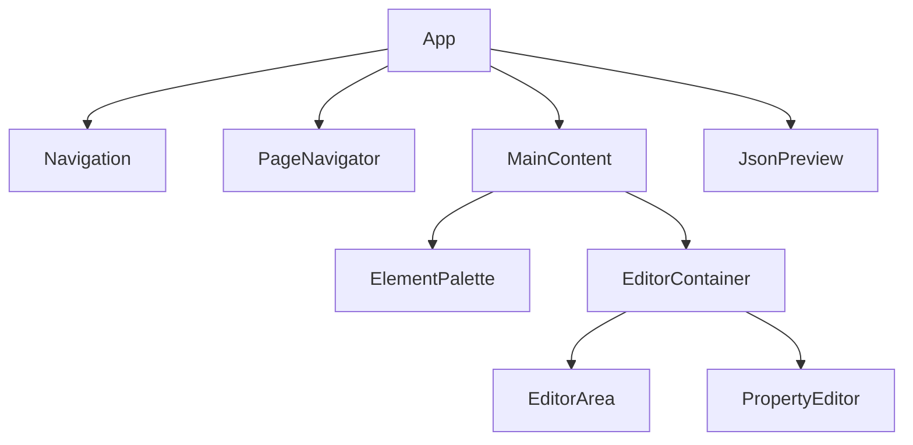

# Technische Dokumentation - Flow UI Toolkit

## Architektur

Das Flow UI Toolkit ist eine React-basierte Anwendung zur dynamischen Erstellung und Bearbeitung von UI-Flows. Die Anwendung nutzt eine komponentenbasierte Architektur mit Context API für das State Management.

### Hauptkomponenten



## Kernkonzepte

### 1. State Management

- **EditorContext**: Zentraler Zustandsmanager
  - Verwaltet den aktuellen Flow
  - Handhabt Undo/Redo-Funktionalität
  - Steuert die Seitennavigation
  - Verwaltet ausgewählte Elemente

### 2. Datenmodell

#### ListingFlow
```typescript
interface ListingFlow {
  id: string;
  'url-key': string;
  name: string;
  title: TranslatableString;
  icon: string;
  pages_edit: Page[];
  pages_view: Page[];
}
```

#### Page
```typescript
interface Page {
  pattern_type: string; // "Page" oder "CustomUIElement"
  id: string;
  layout?: string; // z.B. "2_COL_RIGHT_FILL" für Edit-Seiten
  related_pages?: RelatedPage[]; // Verknüpfung zu korrespondierenden Seiten
  short_title?: TranslatableString; // Kurztitel für kompakte Anzeige
  title?: TranslatableString; // Vollständiger Seitentitel
  icon?: string; // Material Design Icon-Name
  elements: PatternLibraryElement[];
}
```

#### TranslatableString
```typescript
interface TranslatableString {
  [key: string]: string; // z.B. { "de": "Deutscher Text", "en": "English text" }
}
```

#### UI-Elemente
Die Anwendung unterstützt verschiedene UI-Elementtypen:
- TextUIElement
- BooleanUIElement
- SingleSelectionUIElement
- NumberUIElement
- DateUIElement
- FileUIElement
- GroupUIElement
- ArrayUIElement
- CustomUIElement
- ChipGroupUIElement
- StringUIElement

### 3. Komponenten im Detail

#### EditorArea
- Hauptbearbeitungsbereich für UI-Elemente
- Unterstützt Drag & Drop
- Ermöglicht verschachtelte Strukturen

#### PropertyEditor
- Bearbeitung von Element-Eigenschaften
- Dynamische Anpassung an Elementtyp
- Mehrsprachenunterstützung

#### PageNavigator
- Verwaltung mehrerer Seiten
- Seiten-Tabs mit anpassbaren Titeln und Icons
- Drag & Drop Seitenreihenfolge
- Bearbeitung von Seiteneigenschaften über Dialog
- Mehrsprachige Seitentitel (kurz und lang)

##### EditPageDialog
- Bearbeitung von Seitentiteln in mehreren Sprachen
- Auswahl von Material Design Icons über IconSelector
- Konfiguration des Seiten-Layouts
- Verknüpfung mit korrespondierenden Seiten (Edit/View)

##### PageTab
- Anzeige von Seitentitel und Icon
- Interaktive Tabs mit Drag & Drop
- Kontextmenü für Bearbeiten/Löschen

## Technische Features

### 1. Drag & Drop
- Implementiert mit React DnD
- Unterstützt:
  - Element-Platzierung
  - Element-Neuordnung
  - Verschachtelung von Elementen

### 2. Undo/Redo
- Vollständige Undo/Redo-Funktionalität
- Zustandsverfolgung über Stack-Struktur
- Unterstützt alle Bearbeitungsoperationen

### 3. JSON-Export/Import
- Vollständige Serialisierung des Flows
- Validierung der Struktur über JSON-Schema
- Live-Preview des JSON
- Speicherung von Seitentiteln und Icons im JSON

### 4. Icon-Auswahl
- Integrierter IconSelector für Material Design Icons
- Kategorisierte Anzeige (Haus & Gebäude, Smart Home & HVAC, etc.)
- Suchfunktion für schnelles Finden
- Vorschau der Icons
- Verwendung für Seiten und UI-Elemente

## Dateisystem-Struktur

```
src/
├── components/
│   ├── DndProvider/
│   ├── EditorArea/
│   ├── ElementPalette/
│   ├── IconSelector/
│   │   └── IconSelector.tsx  # Komponente zur Auswahl von Material Design Icons
│   ├── JsonPreview/
│   ├── Navigation/
│   ├── PageNavigator/
│   │   ├── PageNavigator.tsx  # Hauptkomponente für Seitenverwaltung
│   │   ├── PageTab.tsx        # Einzelne Seiten-Tabs mit Icon-Unterstützung
│   │   └── EditPageDialog.tsx # Dialog zur Bearbeitung von Seiteneigenschaften
│   └── PropertyEditor/
├── context/
│   ├── EditorContext.tsx     # Verwaltet den Zustand inkl. Seitentitel und Icons
│   └── SchemaContext.tsx     # JSON-Schema-Validierung
├── models/
│   ├── listingFlow.ts        # Datenmodelle für Flow, Page, etc.
│   └── uiElements.ts         # UI-Element-Definitionen
└── utils/
```

## Technische Abhängigkeiten

- React
- Material-UI (@mui/material)
- Styled Components
- React DnD

## Performance-Überlegungen

1. **Zustandsmanagement**
   - Optimierte Render-Zyklen durch Context
   - Selektive Updates von UI-Elementen

2. **Speichernutzung**
   - Effiziente Undo/Redo-Stacks
   - Lazy Loading von Komponenten

3. **UI-Reaktivität**
   - Optimierte Drag & Drop-Operationen
   - Effiziente JSON-Vorschau-Aktualisierung

## Sicherheitsaspekte

1. **Datensicherheit**
   - Validierung von Import/Export-Daten
   - Typ-Sicherheit durch TypeScript

2. **Fehlervermeidung**
   - Strenge Typprüfungen
   - Validierung von Benutzereingaben

## Erweiterbarkeit

Die Architektur ermöglicht einfache Erweiterungen durch:

1. **Neue UI-Elemente**
   - Implementierung neuer Element-Interfaces
   - Erweiterung des ElementPalette

2. **Custom Components**
   - Integration benutzerdefinierter Komponenten
   - Erweiterbare Renderer-Struktur

3. **Zusätzliche Features**
   - Modularer Aufbau für neue Funktionen
   - Erweiterbare Context-Struktur

4. **Icon-Bibliothek**
   - Erweiterbare Material Design Icon-Sammlung
   - Anpassbare Kategorisierung für domänenspezifische Icons
   - Einfache Integration neuer Icon-Pakete

5. **Mehrsprachigkeit**
   - Erweiterbare Sprachunterstützung für Seitentitel und UI-Elemente
   - Konsistente Verwendung von TranslatableString für alle Texte
