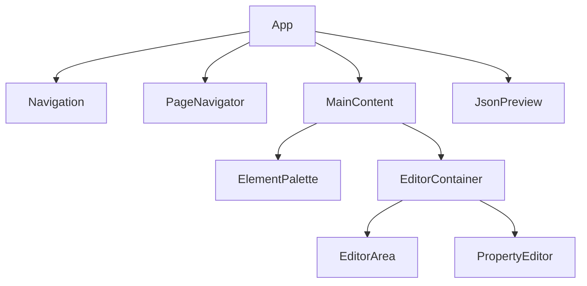

# Technische Dokumentation - Flow UI Toolkit

## Architektur

Das Flow UI Toolkit ist eine React-basierte Anwendung zur dynamischen Erstellung und Bearbeitung von UI-Flows. Die Anwendung nutzt eine komponentenbasierte Architektur mit Context API für das State Management.

### Hauptkomponenten



## Kernkonzepte

### 1. State Management

- **EditorContext**: Zentraler Zustandsmanager
  - Verwaltet den aktuellen Flow
  - Handhabt Undo/Redo-Funktionalität
  - Steuert die Seitennavigation
  - Verwaltet ausgewählte Elemente

### 2. Datenmodell

#### ListingFlow
```typescript
interface ListingFlow {
  id: string;
  'url-key': string;
  name: string;
  title: TranslatableString;
  icon: string;
  pages_edit: Page[];
  pages_view: Page[];
}
```

#### Page
```typescript
interface Page {
  pattern_type: string; // "Page" oder "CustomUIElement"
  id: string;
  layout?: string; // z.B. "2_COL_RIGHT_FILL" für Edit-Seiten
  related_pages?: RelatedPage[]; // Verknüpfung zu korrespondierenden Seiten
  short_title?: TranslatableString; // Kurztitel für kompakte Anzeige
  title?: TranslatableString; // Vollständiger Seitentitel
  icon?: string; // Material Design Icon-Name
  elements: PatternLibraryElement[];
}
```

#### TranslatableString
```typescript
interface TranslatableString {
  [key: string]: string; // z.B. { "de": "Deutscher Text", "en": "English text" }
}
```

#### UI-Elemente
Die Anwendung unterstützt verschiedene UI-Elementtypen:
- **TextUIElement**: Statische Textanzeige (Überschriften, Absätze) - keine Benutzereingabe
- **StringUIElement**: Texteingabefeld für Benutzereingaben mit Validierung
- **BooleanUIElement**: Ja/Nein-Auswahl
  - Unterstützt verschiedene Darstellungsarten: SWITCH, CHECKBOX, DROPDOWN, RADIO, BUTTONGROUP
  - Anpassbare Beschriftungen für Wahr/Falsch-Werte
- **SingleSelectionUIElement**: Einzelauswahl aus mehreren Optionen
- **NumberUIElement**: Zahleneingabe
- **DateUIElement**: Datumseingabe
- **FileUIElement**: Datei-Upload
- **GroupUIElement**: Container für Elementgruppierung
- **ArrayUIElement**: Container für wiederholbare Elemente
- **CustomUIElement**: Spezielle benutzerdefinierte Komponenten
- **ChipGroupUIElement**: Mehrfachauswahl mit Chips

> **Wichtiger Unterschied**: `TextUIElement` ist für statische Anzeige, `StringUIElement` für Benutzereingaben.

### 3. Komponenten im Detail

#### EditorArea
- Hauptbearbeitungsbereich für UI-Elemente
- Unterstützt Drag & Drop
- Ermöglicht verschachtelte Strukturen
- Verbesserte Pfadnavigation für tiefe Verschachtelungen
- Intelligente Containertyp-Erkennung für verschiedene Elementtypen

#### PropertyEditor und EnhancedPropertyEditor
- Bearbeitung von Element-Eigenschaften
- Dynamische Anpassung an Elementtyp
- Mehrsprachenunterstützung
- Modulare Struktur mit spezialisierten Editor-Komponenten
- Factory-Pattern für elementtypspezifische Editoren
- Wiederverwendbare UI-Komponenten für konsistente Benutzeroberfläche
- Verbesserte Anzeige von Containereigenschaften und Unterelementen
- Unterstützung für komplexe JSON-Strukturen und Subflows

##### ElementEditorFactory und EnhancedElementEditorFactory
- Factory-Pattern zur Instanziierung des passenden Editors für jeden Elementtyp
- Zentrale Stelle für die Registrierung neuer Editor-Komponenten
- Erleichtert die Erweiterung um neue Elementtypen
- Verbesserte Wartbarkeit durch Trennung von Logik und Darstellung

##### Spezialisierte Editor-Komponenten
- **TextElementEditor**: Bearbeitung von Textblöcken (Überschriften, Absätze)
- **BooleanElementEditor**: Bearbeitung von Ja/Nein-Feldern mit verschiedenen Darstellungsarten
- **SingleSelectionElementEditor**: Bearbeitung von Auswahlfeldern mit konfigurierbaren Optionen
- **NumberElementEditor**: Bearbeitung von Zahlenfeldern mit Min/Max-Werten und Schrittweite
- **DateElementEditor**: Bearbeitung von Datumsfeldern mit verschiedenen Formaten
- **StringElementEditor**: Bearbeitung von Texteingabefeldern mit Validierungsoptionen
- **GroupElementEditor**: Bearbeitung von Gruppenelementen mit Einklapp-Funktion
- **ArrayElementEditor**: Bearbeitung von Array-Elementen mit Min/Max-Anzahl
- **ChipGroupEditor**: Bearbeitung von Chip-Gruppen mit konfigurierbaren Optionen
- **FileElementEditor**: Bearbeitung von Datei-Upload-Elementen
- **CustomElementEditor**: Bearbeitung von benutzerdefinierten Komponenten (Scanner, Adresse, etc.)

##### VisibilityConditionEditor
- Eigenständige Komponente für die Bearbeitung von Sichtbarkeitsregeln
- Unterstützt komplexe logische Verknüpfungen (AND, OR, NOT)
- Feldbasierte Bedingungen mit verschiedenen Operatoren
- Kontextbasierte Bedingungen (CREATE, EDIT, VIEW, BACK_OFFICE)
- Dynamische Feldauswahl aus allen verfügbaren Feldern
- Typspezifische Werteeingabe je nach Feldtyp

#### HybridEditor
- Kombiniert die Vorteile von EditorArea und PropertyEditor
- Verbesserte Benutzeroberfläche mit drei Hauptbereichen:
  - Strukturnavigator: Hierarchische Anzeige aller Elemente mit Containertyp-Informationen
  - EnhancedPropertyEditor: Verbesserte Eigenschaftsbearbeitung mit Containertyp-Anzeige
  - ElementContextView: Kontextinformationen zum ausgewählten Element mit detaillierten Strukturinformationen
- Unterstützt komplexe Elementstrukturen und Subflows
- Optimierte Benutzerführung für verschachtelte Elemente
- Verbesserte Pfadnavigation für tiefe Verschachtelungen (bis zu 6 Ebenen)
- Intelligente Containertyp-Erkennung und -Anzeige (group, array, chipgroup, custom, subflow)
- Optimierte Hinzufügung von Elementen in verschiedenen Containertypen
- Verbesserte Breadcrumb-Navigation mit Containertyp-Informationen

#### PageNavigator
- Verwaltung mehrerer Seiten
- Seiten-Tabs mit anpassbaren Titeln und Icons
- Drag & Drop Seitenreihenfolge
- Bearbeitung von Seiteneigenschaften über Dialog
- Mehrsprachige Seitentitel (kurz und lang)

##### EditPageDialog
- Bearbeitung von Seitentiteln in mehreren Sprachen
- Auswahl von Material Design Icons über IconSelector
- Konfiguration des Seiten-Layouts
- Verknüpfung mit korrespondierenden Seiten (Edit/View)

##### PageTab
- Anzeige von Seitentitel und Icon
- Interaktive Tabs mit Drag & Drop
- Kontextmenü für Bearbeiten/Löschen

## Technische Features

### 1. Drag & Drop
- Implementiert mit React DnD
- Unterstützt:
  - Element-Platzierung
  - Element-Neuordnung
  - Verschachtelung von Elementen

### 2. Undo/Redo
- Vollständige Undo/Redo-Funktionalität
- Zustandsverfolgung über Stack-Struktur
- Unterstützt alle Bearbeitungsoperationen

### 3. JSON-Export/Import
- Vollständige Serialisierung des Flows
- Validierung der Struktur über JSON-Schema
- Live-Preview des JSON
- Speicherung von Seitentiteln und Icons im JSON
- Automatische Strukturnormalisierung für konsistente JSON-Ausgabe
- Unterstützung für komplexe JSON-Strukturen wie doorbit_original.json
- Validierung und Korrektur von Strukturfehlern
- Konsistente Einwicklung von Elementen in PatternLibraryElement-Objekte
- **Trennung von internen UUIDs und externen Field-IDs**:
  - Beim Import werden Flows zunächst mit `normalizeElementTypes` normalisiert und anschließend mit `ensureUUIDs` um interne `uuid`-Felder ergänzt.
  - `field_id.field_name` von importierten Dateien (z.B. `doorbit_esg (2).json`) bleibt dabei unverändert.
  - Beim Export wird über `transformFlowForExport` ein Export-Flow erzeugt, der alle internen `uuid`-Felder entfernt und `visibility_condition`-Strukturen von technischen UUIDs bereinigt.
  - Dadurch sind Roundtrips (Import → Bearbeitung → Export) möglich, ohne dass sich `field_id.field_name` oder die Struktur ändern.

### 4. Icon-Auswahl
- Integrierter IconSelector für Material Design Icons
- Kategorisierte Anzeige (Haus & Gebäude, Smart Home & HVAC, etc.)
- Suchfunktion für schnelles Finden
- Vorschau der Icons
- Verwendung für Seiten und UI-Elemente

## Dateisystem-Struktur

```
src/
├── components/
│   ├── DndProvider/
│   ├── EditorArea/
│   ├── ElementPalette/
│   ├── HybridEditor/          # Verbesserte Editor-Komponente
│   │   ├── HybridEditor.tsx   # Hauptkomponente des verbesserten Editors
│   │   ├── StructureNavigator.tsx # Hierarchische Anzeige der Elementstruktur
│   │   ├── EnhancedPropertyEditor.tsx # Verbesserte Eigenschaftsbearbeitung
│   │   ├── ElementContextView.tsx # Kontextinformationen zum ausgewählten Element
│   │   ├── EnhancedElementEditorFactory.tsx # Factory für spezialisierte Editoren
│   │   └── VisibilityLegend.tsx # Legende für Sichtbarkeitsregeln
│   ├── IconSelector/
│   │   └── IconSelector.tsx  # Komponente zur Auswahl von Material Design Icons
│   ├── JsonPreview/
│   ├── Navigation/
│   ├── PageNavigator/
│   │   ├── PageNavigator.tsx  # Hauptkomponente für Seitenverwaltung
│   │   ├── PageTab.tsx        # Einzelne Seiten-Tabs mit Icon-Unterstützung
│   │   └── EditPageDialog.tsx # Dialog zur Bearbeitung von Seiteneigenschaften
│   └── PropertyEditor/
│       ├── common/            # Wiederverwendbare UI-Komponenten
│       │   ├── TranslatableField.tsx # Mehrsprachige Texteingabe
│       │   └── SectionTitle.tsx # Formatierte Abschnittstitel
│       ├── editors/           # Spezialisierte Editor-Komponenten
│       │   ├── TextElementEditor.tsx # Editor für Textblöcke
│       │   ├── BooleanElementEditor.tsx # Editor für Ja/Nein-Felder
│       │   ├── SingleSelectionElementEditor.tsx # Editor für Auswahlfelder
│       │   ├── NumberElementEditor.tsx # Editor für Zahlenfelder
│       │   ├── DateElementEditor.tsx # Editor für Datumsfelder
│       │   ├── StringElementEditor.tsx # Editor für Texteingabefelder
│       │   ├── GroupElementEditor.tsx # Editor für Gruppenelemente
│       │   ├── ArrayElementEditor.tsx # Editor für Array-Elemente
│       │   ├── ChipGroupEditor.tsx # Editor für Chip-Gruppen
│       │   ├── FileElementEditor.tsx # Editor für Datei-Upload
│       │   ├── CustomElementEditor.tsx # Editor für benutzerdefinierte Komponenten
│       │   ├── VisibilityConditionEditor.tsx # Editor für Sichtbarkeitsregeln
│       │   └── index.ts # Export aller Editor-Komponenten
│       ├── ElementEditorFactory.tsx  # Factory für elementtypspezifische Editoren
│       ├── CommonPropertiesEditor.tsx # Editor für gemeinsame Eigenschaften
│       └── PropertyEditor.tsx # Klassische PropertyEditor-Implementierung
├── context/
│   ├── EditorContext.tsx     # Verwaltet den Zustand inkl. Seitentitel und Icons
│   ├── SchemaContext.tsx     # JSON-Schema-Validierung
│   └── FieldValuesContext.tsx # Verwaltet Feldwerte für Visibility-Bedingungen
├── models/
│   ├── listingFlow.ts        # Datenmodelle für Flow, Page, etc.
│   └── uiElements.ts         # UI-Element-Definitionen
└── utils/
    ├── visibilityUtils.ts    # Auswertung von Visibility-Bedingungen
    ├── optimizedVisibilityUtils.ts # Optimierte Auswertung mit Memoization
    ├── SubflowManager.ts     # Verwaltung von Subflows
    ├── uuidUtils.ts          # UUID-Generierung und -Verwaltung
    ├── normalizeUtils.ts     # Strukturnormalisierung und -validierung
    ├── pathUtils.ts          # Pfadnavigation und -manipulation
    └── containerUtils.ts     # Containertyp-Erkennung und -Verwaltung
```

## Technische Abhängigkeiten

- React
- Material-UI (@mui/material)
- Styled Components
- React DnD
- Lodash (für Memoization und Utility-Funktionen)

## Performance-Überlegungen

1. **Zustandsmanagement**
   - Optimierte Render-Zyklen durch Context
   - Selektive Updates von UI-Elementen
   - Memoization für rechenintensive Operationen
   - Optimierte Zustandsaktualisierungen durch modulare Struktur
   - Verbesserte Trennung von Logik und Darstellung durch Factory-Pattern

2. **Speichernutzung**
   - Effiziente Undo/Redo-Stacks
   - Lazy Loading von Komponenten
   - Intelligente Caching-Strategien für Visibility-Bedingungen
   - Optimierte Komponentenstruktur mit spezialisierten Editoren

3. **UI-Reaktivität**
   - Optimierte Drag & Drop-Operationen
   - Effiziente JSON-Vorschau-Aktualisierung
   - Reduzierte Re-Renders durch Component Factory Pattern
   - Optimierte Auswertung von Visibility-Bedingungen mit Abhängigkeitsverfolgung
   - Verbesserte Benutzeroberfläche mit HybridEditor für komplexe Strukturen
   - Hierarchische Strukturnavigation für bessere Übersicht

## Sicherheitsaspekte

1. **Datensicherheit**
   - Validierung von Import/Export-Daten
   - Typ-Sicherheit durch TypeScript

2. **Fehlervermeidung**
   - Strenge Typprüfungen
   - Validierung von Benutzereingaben

## Erweiterbarkeit

Die Architektur ermöglicht einfache Erweiterungen durch:

1. **Neue UI-Elemente**
   - Implementierung neuer Element-Interfaces
   - Erweiterung des ElementPalette
   - Einfache Integration in ElementEditorFactory und EnhancedElementEditorFactory
   - Standardisierte Implementierung spezialisierter Editor-Komponenten

2. **Custom Components**
   - Integration benutzerdefinierter Komponenten
   - Erweiterbare Renderer-Struktur
   - Modulare Editor-Komponenten für neue Elementtypen
   - Unterstützung für komplexe Komponenten wie Scanner, Adresse, Standort, etc.

3. **Zusätzliche Features**
   - Modularer Aufbau für neue Funktionen
   - Erweiterbare Context-Struktur
   - Wiederverwendbare Utilities für gemeinsame Funktionalitäten
   - Einfache Integration neuer Editoren durch Factory-Pattern

4. **Icon-Bibliothek**
   - Erweiterbare Material Design Icon-Sammlung
   - Anpassbare Kategorisierung für domänenspezifische Icons
   - Einfache Integration neuer Icon-Pakete
   - Verbesserte Kategorisierung für domänenspezifische Anwendungsfälle

5. **Visibility-Bedingungen**
   - Erweiterbare Bedingungstypen
   - Unterstützung für komplexe logische Verknüpfungen
   - Einfache Integration neuer Operatoren
   - Typspezifische Werteeingabe für verschiedene Feldtypen

5. **Mehrsprachigkeit**
   - Erweiterbare Sprachunterstützung für Seitentitel und UI-Elemente
   - Konsistente Verwendung von TranslatableString für alle Texte
   - Wiederverwendbare TranslatableField-Komponente

6. **Visibility-Bedingungen**
   - Erweiterbare Bedingungstypen
   - Optimierte Auswertungsstrategien
   - Modulare VisibilityConditionEditor-Komponente

7. **Subflow-Management**
   - Flexible Verwaltung von Subflows durch SubflowManager
   - Erweiterbare Subflow-Typen
   - Wiederverwendbare Funktionen für Subflow-Operationen
