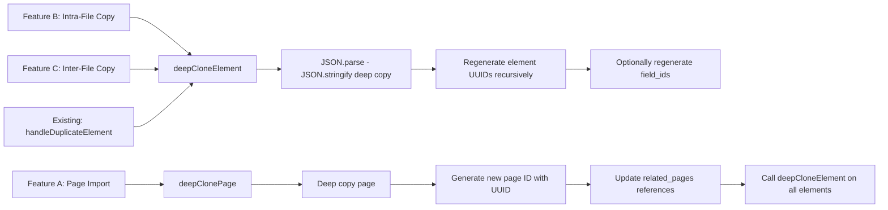
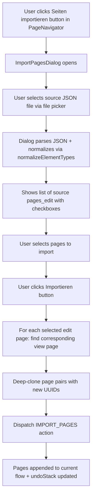
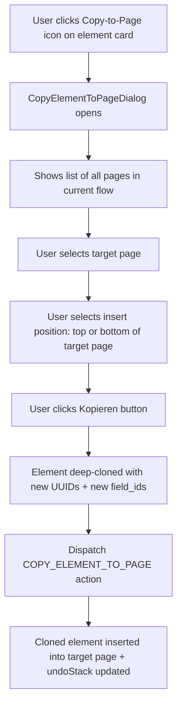
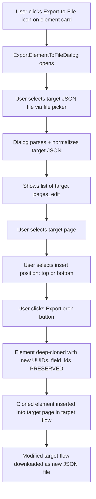
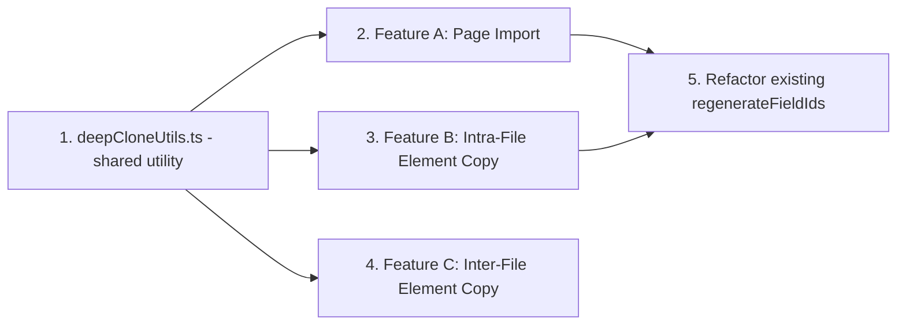
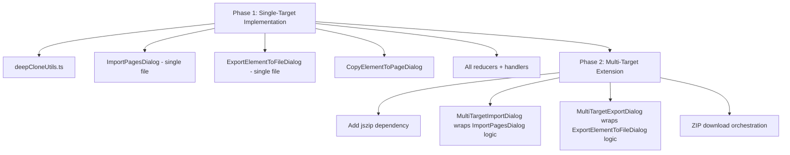

# Comprehensive Plan: Page Import + Element Copy (Intra-File & Inter-File)

## Overview

This plan covers three interconnected features that share a common deep-clone utility layer:

| Feature | Description | Scope |
|---|---|---|
| **A: Page Import** | Import entire pages from an external JSON file into the current flow | Page-level, cross-file |
| **B: Intra-File Element Copy** | Copy a single element (incl. nested children) from one page to another within the same flow | Element-level, same file |
| **C: Inter-File Element Copy** | Copy a single element (incl. nested children) to a page in a different JSON file | Element-level, cross-file |

---

## Architecture: Shared Utility Layer

All three features rely on **deep-cloning with UUID regeneration**. Currently, [`regenerateFieldIds()`](src/App.tsx:2057) in App.tsx handles this for element duplication. We will extract and extend this into a shared utility.

### New File: `src/utils/deepCloneUtils.ts`



**Key Functions:**

| Function | Purpose | field_id behavior |
|---|---|---|
| `deepCloneElement(element, options)` | Deep-clone a PatternLibraryElement with new UUIDs | `preserveFieldIds: true` = keep field_ids; `false` = regenerate |
| `deepClonePage(editPage, viewPage)` | Deep-clone a page pair with new IDs | Elements get new UUIDs; field_ids are preserved (cross-file import keeps data bindings intact within the page) |
| `regenerateElementUUIDs(element)` | Regenerate only UUIDs (not field_ids) for all nested elements | Preserves field_ids |

**Design Decision: `field_id` handling**

- **Page Import (Feature A):** `field_id`s are **preserved** — the imported page's internal data bindings must remain intact. The field_ids are unique within a page context and reference field values, not element identity.
- **Intra-File Element Copy (Feature B):** `field_id`s are **regenerated** — copying an element to another page within the same flow would create duplicate field_ids in the same flow, which could cause data binding conflicts.
- **Inter-File Element Copy (Feature C):** `field_id`s are **preserved** — the target file is a different flow, so no conflict exists.

---

## Feature A: Import Pages from External JSON

### UX Flow



### Files to Create/Modify

| File | Change |
|---|---|
| `src/utils/deepCloneUtils.ts` | **NEW** — Shared deep-clone utilities |
| `src/components/PageNavigator/ImportPagesDialog.tsx` | **NEW** — MUI Dialog with file picker + page checklist |
| `src/components/PageNavigator/PageNavigator.tsx` | Add "Seiten importieren" IconButton next to "+" button |
| `src/context/EditorContext.tsx` | Add `IMPORT_PAGES` action type + reducer logic |
| `src/App.tsx` | Add `handleImportPages` handler; refactor `regenerateFieldIds` to use shared utility |

### Detailed Implementation

#### A1. `src/utils/deepCloneUtils.ts` (Shared Utility)

```ts
// Core functions:
export interface DeepCloneOptions {
  preserveFieldIds: boolean;  // true = keep field_ids, false = regenerate
  regenerateUUIDs: boolean;   // true = new UUIDs for all elements
}

export function deepCloneElement(
  element: PatternLibraryElement, 
  options: DeepCloneOptions
): PatternLibraryElement

export function deepClonePagePair(
  editPage: Page, 
  viewPage: Page | undefined
): { editPage: Page; viewPage: Page }

export function regenerateAllUUIDs(
  element: PatternLibraryElement
): PatternLibraryElement
```

**Implementation details:**
1. `JSON.parse(JSON.stringify(...))` for deep copy (same pattern as existing `regenerateFieldIds`)
2. Recursively walk all element types: `GroupUIElement.elements`, `ArrayUIElement.elements`, `ChipGroupUIElement.chips`, `CustomUIElement.sub_flows`, `CustomUIElement.elements`, `SingleSelectionUIElement.other_user_value.text_ui_element`
3. For each element: assign `uuid = uuidv4()`
4. If `preserveFieldIds: false`: regenerate `field_id`, `id_field_id`, `caption_field_id` (using existing prefix logic from `regenerateFieldIds`)
5. For pages: generate new page IDs (`edit-<newUuid>`, `view-<newUuid>`), update `related_pages`

#### A2. `ImportPagesDialog` Component

**Props:**
```ts
interface ImportPagesDialogProps {
  open: boolean;
  onClose: () => void;
  onImport: (editPages: Page[], viewPages: Page[]) => void;
}
```

**Internal State:**
- `sourceFlow: ListingFlow | null` — parsed + normalized source JSON
- `sourceFileName: string` 
- `selectedPageIds: string[]` — checked edit-page IDs
- `error: string | null`

**UI Layout:**
1. File picker button ("Datei auswählen") + filename display
2. Source flow name + page count summary
3. List of `sourceFlow.pages_edit` with:
   - Checkbox for selection
   - Page title (`page.title?.de || page.id`)
   - Element count
   - "Alle auswählen" / "Auswahl aufheben" toggle
4. "Importieren" button (disabled if no pages selected)
5. MUI Alert for errors

**On Import click:**
1. For each selected edit page ID, find the corresponding view page via `related_pages` or ID convention (`edit-xxx` → `view-xxx`)
2. Call `deepClonePagePair(editPage, viewPage)` for each pair
3. Call `onImport(clonedEditPages, clonedViewPages)`

#### A3. `IMPORT_PAGES` Action + Reducer

```ts
// New action type:
{ type: 'IMPORT_PAGES'; payload: { editPages: Page[]; viewPages: Page[] } }
```

**Reducer logic:**
```
1. Save currentFlow to undoStack
2. Append all payload.editPages to state.currentFlow.pages_edit
3. Append all payload.viewPages to state.currentFlow.pages_view
4. Call ensureUUIDs on updated flow
5. Select the first imported page
6. Clear redoStack
```

#### A4. PageNavigator Changes

Add an IconButton with `FileUploadIcon` next to the existing "+" (Add Page) button:
```tsx
<Tooltip title="Seiten aus anderer JSON-Datei importieren">
  <IconButton onClick={() => setImportDialogOpen(true)}>
    <FileUploadIcon />
  </IconButton>
</Tooltip>
```

### Edge Cases

- **Source JSON has no pages_edit**: Show error "Die Datei enthält keine Seiten."
- **Source JSON is invalid**: Show MUI Alert with parse error
- **View page not found for an edit page**: Create a minimal empty view page (same pattern as `ADD_PAGE` reducer)
- **Importing into empty flow**: Works normally — pages are appended
- **Duplicate page titles**: Allowed — only IDs must be unique (guaranteed by new UUIDs)

---

## Feature B: Intra-File Element Copy (Same Flow, Different Page)

### UX Flow



### Files to Create/Modify

| File | Change |
|---|---|
| `src/components/HybridEditor/CopyElementToPageDialog.tsx` | **NEW** — Dialog for selecting target page + position |
| `src/components/HybridEditor/ElementContextView.tsx` | Add "Zu Seite kopieren" button on element cards |
| `src/components/HybridEditor/HybridEditor.tsx` | Pass new `onCopyToPage` prop through |
| `src/context/EditorContext.tsx` | Add `COPY_ELEMENT_TO_PAGE` action + reducer |
| `src/App.tsx` | Add `handleCopyElementToPage` handler with validation |
| `src/utils/deepCloneUtils.ts` | Already created in Feature A — reused here |

### Detailed Implementation

#### B1. `CopyElementToPageDialog` Component

**Props:**
```ts
interface CopyElementToPageDialogProps {
  open: boolean;
  onClose: () => void;
  onCopy: (targetPageId: string, position: 'top' | 'bottom') => void;
  pages: Page[];          // All pages_edit from current flow
  currentPageId: string;  // Current page (pre-selected or disabled)
  elementTitle: string;   // Name of the element being copied (for display)
}
```

**UI Layout:**
1. Title: "Element auf andere Seite kopieren"
2. Element name display (read-only)
3. Page selector: Radio buttons or Select dropdown listing all pages
   - Current page is listed but marked with "(aktuelle Seite)" label
   - Copying to the current page is allowed (equivalent to duplicate)
4. Position selector: RadioGroup with "Am Anfang der Seite" / "Am Ende der Seite"
5. "Kopieren" + "Abbrechen" buttons

#### B2. `COPY_ELEMENT_TO_PAGE` Action + Reducer

```ts
// New action type:
{ 
  type: 'COPY_ELEMENT_TO_PAGE'; 
  payload: { 
    sourcePath: number[];       // Path of the element on the source page
    sourcePageId: string;       // Page ID of the source
    targetPageId: string;       // Page ID of the target
    position: 'top' | 'bottom'; // Insert at start or end
    clonedElement: PatternLibraryElement; // Pre-cloned element (with new field_ids + UUIDs)
  } 
}
```

**Reducer logic:**
```
1. Save currentFlow to undoStack
2. Find target page in pages_edit by targetPageId
3. If position === 'top': insert clonedElement at index 0
4. If position === 'bottom': append clonedElement at end
5. Update pages_edit with modified target page
6. Clear redoStack, set isDirty
```

Note: The cloning (with `field_id` regeneration) is done in `App.tsx` before dispatch, NOT in the reducer. This keeps the reducer simple and allows App.tsx to handle validation first.

#### B3. ElementContextView Changes

Add a new button on each element card (next to the existing duplicate and delete icons):

```tsx
<Tooltip title="Element auf andere Seite kopieren">
  <IconButton
    size="small"
    onClick={(e) => {
      e.stopPropagation();
      onCopyToPage(fullPath);
    }}
  >
    <FileCopyIcon fontSize="small" />
  </IconButton>
</Tooltip>
```

Using `FileCopyIcon` (different from `ContentCopyIcon` used for duplicate) to visually distinguish "copy to page" from "duplicate on same page".

#### B4. Validation (in App.tsx `handleCopyElementToPage`)

Before dispatching:
1. **Source element exists**: `getElementByPath(sourcePageElements, path)` returns non-null
2. **Target page exists**: `pages_edit.find(p => p.id === targetPageId)` returns non-null
3. **Deep clone with new field_ids**: `deepCloneElement(element, { preserveFieldIds: false, regenerateUUIDs: true })`
   - `field_ids` are regenerated because copying within the same flow could cause conflicts
4. **Snackbar on success**: "Element erfolgreich auf Seite '[pageName]' kopiert"

### Edge Cases

- **Copying to current page**: Allowed — equivalent to duplicate but at top/bottom position
- **Deeply nested Group-in-Group**: Handled by recursive `deepCloneElement` — all nested elements get new UUIDs and field_ids
- **Elements with visibility_condition referencing field_ids**: The visibility conditions reference `field_id.field_name` values. When field_ids are regenerated, the **visibility conditions still reference the OLD field_ids**. This means: 
  - The copied element's own visibility conditions may reference fields that still exist on the source page (cross-page reference = intentional, since visibility can reference fields from any page in the flow)
  - **No automatic update of visibility condition field_id references** — this is correct behavior, as visibility conditions often reference fields on other pages
- **Copying between pages_edit and pages_view**: **Not supported in Phase 1** — the dialog only shows `pages_edit`. View pages have a fundamentally different element type set (e.g., `ImageGalleryUIElement`, `FieldTextUIElement`, `TableUIElement` vs. edit-mode elements like `StringUIElement`, `NumberUIElement`)
- **`ChipGroupUIElement` chips**: Each chip's `field_id` is also regenerated when `preserveFieldIds: false`

---

## Feature C: Inter-File Element Copy (To External JSON File)

### UX Flow



### Files to Create/Modify

| File | Change |
|---|---|
| `src/components/HybridEditor/ExportElementToFileDialog.tsx` | **NEW** — Dialog for target file + page selection |
| `src/components/HybridEditor/ElementContextView.tsx` | Add "In andere Datei exportieren" button |
| `src/components/HybridEditor/HybridEditor.tsx` | Pass new `onExportToFile` prop through |
| `src/App.tsx` | Add `handleExportElementToFile` handler |
| `src/utils/deepCloneUtils.ts` | Already created — reused here |

### Detailed Implementation

#### C1. `ExportElementToFileDialog` Component

**Props:**
```ts
interface ExportElementToFileDialogProps {
  open: boolean;
  onClose: () => void;
  elementToExport: PatternLibraryElement | null;
  elementTitle: string;
}
```

**Internal State:**
- `targetFlow: ListingFlow | null` — parsed + normalized target JSON
- `targetFileName: string`
- `selectedPageId: string | null` — selected target page
- `position: 'top' | 'bottom'`
- `error: string | null`

**UI Layout:**
1. Title: "Element in andere JSON-Datei exportieren"
2. Element name display (read-only)
3. File picker: "Zieldatei auswählen" button + filename display
4. Target flow info: flow name + page count
5. Page selector: List of target `pages_edit` with radio buttons
6. Position: RadioGroup "Am Anfang" / "Am Ende"
7. "Exportieren" + "Abbrechen" buttons

**On Export click:**
1. Deep-clone element with `deepCloneElement(element, { preserveFieldIds: true, regenerateUUIDs: true })`
   - `field_ids` preserved — target file is a different flow context
   - UUIDs regenerated to ensure uniqueness in the target
2. Insert cloned element into the selected target page
3. Call `ensureUUIDs()` on the modified target flow
4. Download the modified target flow as JSON (same download pattern as `handleSave`)
5. Show success Snackbar

**Important:** This feature does NOT modify the current flow. It only:
- Reads the current element from the current flow (source)
- Modifies an external file (target)
- Downloads the modified external file

#### C2. ElementContextView Changes

Add button (rendered only when not in selection mode):

```tsx
<Tooltip title="Element in andere JSON-Datei exportieren">
  <IconButton
    size="small"
    onClick={(e) => {
      e.stopPropagation();
      onExportToFile(fullPath);
    }}
  >
    <IosShareIcon fontSize="small" />
  </IconButton>
</Tooltip>
```

#### C3. Download Mechanism

Reuse the existing download pattern from [`handleSave`](src/App.tsx:2331):

```ts
const json = JSON.stringify(modifiedTargetFlow, null, 2);
const blob = new Blob([json], { type: 'application/json' });
const url = URL.createObjectURL(blob);
const a = document.createElement('a');
a.href = url;
a.download = `${targetFileName}_modified.json`;
document.body.appendChild(a);
a.click();
document.body.removeChild(a);
URL.revokeObjectURL(url);
```

#### C4. Validation

1. **Target file is valid JSON**: Parse error → show in Alert
2. **Target file has pages_edit**: No pages → "Die Zieldatei enthält keine Seiten."
3. **Target page selected**: Required before export
4. **Element compatibility**: The target page must accept the element type. Use logic similar to [`isElementAllowedInParent`](src/App.tsx:1639) to check
5. **Normalization**: Apply `normalizeElementTypes()` to target JSON before inserting

### Edge Cases

- **Target file has different schema version**: `normalizeElementTypes` handles schema differences
- **Target file is the same as the currently open file**: Allowed — the user gets a downloaded copy with the extra element
- **Element contains visibility conditions with field_id references to the source flow**: These references will NOT exist in the target flow. **Show a warning** if the element or its children have `visibility_condition` with `RelationalFieldOperator` references: "Achtung: Das Element enthält Sichtbarkeitsbedingungen, die auf Felder verweisen, die in der Zieldatei möglicherweise nicht existieren."
- **Deeply nested structures**: Fully handled by recursive `deepCloneElement`
- **Target file uses `transformFlowForExport` (strips UUIDs)**: We call `ensureUUIDs` after insertion, so the downloaded file will have all UUIDs

---

## Shared Utility: `src/utils/deepCloneUtils.ts` — Detailed Design

### Functions

```ts
import { v4 as uuidv4 } from 'uuid';
import { PatternLibraryElement, Page } from '../models/listingFlow';

export interface DeepCloneElementOptions {
  preserveFieldIds: boolean;
  regenerateUUIDs: boolean;
}

/**
 * Deep-clones a PatternLibraryElement with all nested children.
 * Recursively handles: GroupUIElement.elements, ArrayUIElement.elements,
 * ChipGroupUIElement.chips, CustomUIElement.sub_flows/.elements,
 * SingleSelectionUIElement.other_user_value.text_ui_element
 */
export function deepCloneElement(
  element: PatternLibraryElement,
  options: DeepCloneElementOptions
): PatternLibraryElement

/**
 * Deep-clones a page pair (edit + view) with new page IDs.
 * All element UUIDs are regenerated. field_ids are preserved.
 * related_pages references are updated to match new IDs.
 */
export function deepClonePagePair(
  editPage: Page,
  viewPage: Page | undefined
): { editPage: Page; viewPage: Page }

/**
 * Checks if an element tree contains visibility conditions
 * that reference field_ids (for cross-file copy warnings).
 */
export function findVisibilityFieldReferences(
  element: PatternLibraryElement
): string[]  // Returns list of referenced field_name values
```

### Relationship to Existing Code

The existing [`regenerateFieldIds`](src/App.tsx:2057) in App.tsx will be **refactored** to use `deepCloneElement`:

```ts
// Before (App.tsx):
const regenerateFieldIds = (element: any): any => { ... }

// After (App.tsx):
const regenerateFieldIds = (element: PatternLibraryElement): PatternLibraryElement => {
  return deepCloneElement(element, { preserveFieldIds: false, regenerateUUIDs: true });
};
```

This ensures backward compatibility while centralizing the logic.

---

## Files Summary: All Features Combined

| File | Feature | Change |
|---|---|---|
| `src/utils/deepCloneUtils.ts` | Shared | **NEW** — Deep-clone + UUID regeneration utilities |
| `src/components/PageNavigator/ImportPagesDialog.tsx` | A | **NEW** — Import pages dialog |
| `src/components/HybridEditor/CopyElementToPageDialog.tsx` | B | **NEW** — Copy element to page dialog |
| `src/components/HybridEditor/ExportElementToFileDialog.tsx` | C | **NEW** — Export element to file dialog |
| `src/components/PageNavigator/PageNavigator.tsx` | A | Add "Seiten importieren" button |
| `src/components/HybridEditor/ElementContextView.tsx` | B, C | Add "Zu Seite kopieren" + "In Datei exportieren" buttons |
| `src/components/HybridEditor/HybridEditor.tsx` | A, B, C | Pass new props through |
| `src/context/EditorContext.tsx` | A, B | Add `IMPORT_PAGES` + `COPY_ELEMENT_TO_PAGE` actions + reducers |
| `src/App.tsx` | A, B, C | Add handlers, refactor `regenerateFieldIds`, pass props |

---

## Implementation Order

The features should be implemented in this order due to dependencies:



### Step-by-step:

1. **Create `deepCloneUtils.ts`** — all three features depend on this
2. **Feature A: Page Import** — largest scope, creates the file-picker pattern reused by Feature C
3. **Feature B: Intra-File Element Copy** — simpler than C, validates the `deepCloneElement` utility
4. **Feature C: Inter-File Element Copy** — reuses patterns from both A (file picker) and B (element copy)
5. **Refactor `regenerateFieldIds`** — update existing duplicate logic to use shared utility
6. **Testing** — TypeScript compilation + browser verification for all features

---

## Acceptance Criteria

### Feature A: Page Import
- [ ] "Seiten importieren" button visible next to "+" in PageNavigator
- [ ] Dialog opens with file picker and shows pages from selected JSON
- [ ] Checkboxes allow multi-selection of pages
- [ ] Imported pages appear in current flow's page tabs
- [ ] Both edit + view pages correctly paired via `related_pages`
- [ ] All element UUIDs regenerated; field_ids preserved
- [ ] Undo/Redo works for import
- [ ] Error handling for invalid JSON files

### Feature B: Intra-File Element Copy
- [ ] "Zu Seite kopieren" button on each element card
- [ ] Dialog shows all pages with page selector
- [ ] Position selector: top or bottom of target page
- [ ] Copied element has new UUIDs AND new field_ids
- [ ] Deeply nested Group/Array elements are fully cloned
- [ ] Undo/Redo works
- [ ] Success Snackbar shown after copy

### Feature C: Inter-File Element Copy  
- [ ] "In andere Datei exportieren" button on each element card
- [ ] Dialog with file picker for target JSON file
- [ ] Target page list shown after file selection
- [ ] Modified target file downloaded with element inserted
- [ ] Element has new UUIDs; field_ids preserved
- [ ] Warning shown if element has visibility condition field references
- [ ] Current flow is NOT modified

### Shared
- [ ] `deepCloneUtils.ts` handles all element types recursively
- [ ] Existing `handleDuplicateElement` refactored to use shared utility
- [ ] Zero TypeScript compilation errors
- [ ] All features work in browser

---

## Appendix: Multi-Target-Export Feasibility Analysis

### Requested Extension

Extend Features A and C to support copying pages/elements to **multiple target JSON files simultaneously**, with per-file configuration of target page and insert position.

### Analysis by Dimension

#### 1. UI/UX Complexity

**Current Single-Target flow**: One file picker → one page list → one position → one action button. Simple linear flow.

**Multi-Target flow would require:**
- A "file collection" area where users add multiple target files
- Per-file configuration panels — which page, which position
- Progress/status indicators per file during processing

**UI Approach Evaluation:**

| Approach | Pros | Cons | Recommendation |
|---|---|---|---|
| **Accordion panels per file** | Each file gets its own collapsible panel with page selector + position | Vertical space explosion with 3+ files; confusing navigation | Acceptable for 2-3 files |
| **Tab-based per file** | Clean separation; familiar pattern | Tab bar grows; no overview of all configurations at once | Good for 3-5 files |
| **Stepper wizard** | Guided flow; one file at a time | Slow for users who know what they want; many steps | Too slow |
| **Table/grid view** | Compact; all files visible at once | Limited space for page selector per row | Best for page export; too cramped for element export |

**Recommendation:** Accordion panels — each added target file gets a collapsible panel showing its page list and position selector.

#### 2. Browser Download Limitations

**Critical constraint:** Modern browsers block multiple programmatic downloads triggered in rapid succession. Only the first `<a>.click()` typically triggers a download; subsequent ones are silently blocked by popup blockers.

**Solutions:**

| Solution | Browser Support | Complexity | User Experience |
|---|---|---|---|
| **Sequential setTimeout delays** | All browsers | Low | Downloads appear one by one; fragile timing |
| **JSZip bundling** | All browsers - needs npm package | Medium | Single ZIP download; user must extract |
| **File System Access API** | Chrome/Edge only | High | Native save dialog; no Firefox/Safari |
| **Prompt per download** | All browsers | Low | User clicks Download per file; manual |

**Recommendation:** **JSZip bundling** — single download, all modified files in one ZIP. Add `jszip` as a dependency. This is the most robust cross-browser solution.

#### 3. UUID Independence

Each target file needs independent UUID generation. The existing `deepCloneElement` utility creates new UUIDs per call. For multi-target:

```ts
// For each target file, clone independently:
targetFiles.forEach(targetFile => {
  const clonedElement = deepCloneElement(sourceElement, options);
  insertIntoTargetPage(targetFile.flow, targetFile.pageId, clonedElement);
});
```

**No changes needed to shared utilities.** Each call produces independent UUIDs.

#### 4. Impact on Existing Plan

| Plan Component | Change Needed for Multi-Target |
|---|---|
| `deepCloneUtils.ts` | **No change** — already produces independent clones per call |
| `ImportPagesDialog` | **Major redesign** → becomes `MultiTargetImportDialog` with file collection + per-file config |
| `ExportElementToFileDialog` | **Major redesign** → becomes `MultiTargetExportDialog` with file collection + per-file config |
| `IMPORT_PAGES` reducer | **No change** — only affects current flow import |
| `COPY_ELEMENT_TO_PAGE` reducer | **No change** — intra-file copy not affected |
| `App.tsx` handlers | **Moderate change** — handler orchestrates multiple file modifications + ZIP download |
| New dependency: `jszip` | **Added** to package.json |

#### 5. Incremental Umsetzbarkeit — Strong Recommendation

**Implement Single-Target first, extend to Multi-Target later.**

Rationale:
1. Shared utilities `deepCloneUtils.ts` are **identical** for single and multi-target
2. Reducer actions are **not affected** by multi-target — multi-target only changes the external file operations
3. The Single-Target dialogs can be **extended** to Multi-Target by adding a file collection layer around the existing per-file configuration
4. Single-Target provides immediate value and validates the core deep-clone + insert logic
5. Multi-Target is purely a **UI orchestration** concern that layers on top



### Conclusion

**Multi-Target is feasible but should be Phase 2.** The architectural foundation from Phase 1 supports it cleanly:
- Shared utilities remain unchanged
- Dialogs are extended, not rewritten
- The main addition is UI orchestration + JSZip for bundled downloads
- Browser download limitations are the only real technical risk, solved by ZIP bundling

**Recommendation: Proceed with the existing plan as Phase 1, then extend to Multi-Target as Phase 2.**
