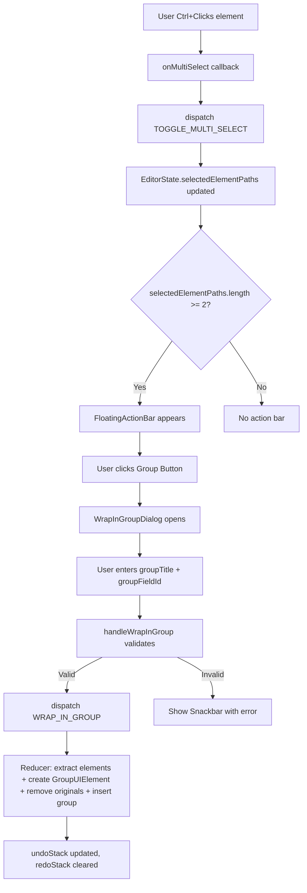
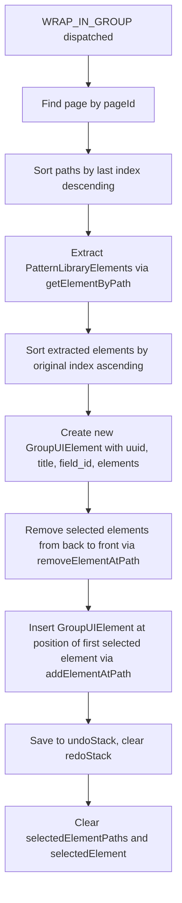

# Multi-Selektion + "Gruppieren"-Button – Implementation Plan

## Overview

Implement multi-selection with a dedicated "Wrap in Group" button in the Flow UI Toolkit Editor. Elements can be selected via `Ctrl+Click`, visually highlighted, and then wrapped into a new `GroupUIElement` instance.

---

## Architecture Analysis

### Current State
- **Single selection** via `selectedElement` and `selectedElementPath` (both in `EditorState`)
- **Click handling** flows: `App.tsx` → `HybridEditor` → `ElementContextView` / `EditorArea`
- **Path manipulation** helpers already exist: `addElementAtPath()`, `removeElementAtPath()`, `getElementByPath()` in `EditorContext.tsx`
- **Validation logic** exists in `isElementAllowedInParent()` in `App.tsx` (line 1639)
- **GroupUIElement** currently has **no `field_id`** property in the TypeScript interface – needs to be added as optional
- **`normalizeElement()`** in `normalizeUtils.ts:248` **auto-generates `field_id`** for all elements without one, using convention `<pattern_type_lowercase>_<uuid>` (e.g., `groupuielement_<uuid>`)

### field_id Analysis (Verified against wkm-heizungstausch_update.json)

The real data confirms:
- `GroupUIElement` **HAS** `field_id` at runtime: `{ field_name: "groupuielement_22aea4e3-..." }` (line 127-129)
- Child elements retain their own `field_id`: `{ field_name: "textuielement_3936f36a-..." }` (line 45-47)
- `ChipGroupUIElement` has `field_id`: `{ field_name: "chipgroupuielement_29f51e01-..." }` (line 235-237)
- **Auto-generation**: `normalizeUtils.ts` line 248-250 generates `field_id` for any element missing it
- **Implication**: The `WrapInGroupDialog` can pre-fill `field_id` with `groupuielement_<uuid>` and let the user override it, OR we can rely on `normalizeElement()` to generate it automatically. Since the task explicitly asks for a `field_id` input in the dialog, we will provide it with a sensible auto-generated default.

### Data Flow Diagram



---

## Detailed Changes per File

### 1. `src/models/uiElements.ts` – Add `field_id` to GroupUIElement

**Why:** The task requires `GroupUIElement` to support a `field_id` property for data binding when wrapping elements into a group.

```typescript
// Line 109 - Add field_id as optional
export interface GroupUIElement extends UIElementEdit {
  pattern_type: 'GroupUIElement';
  field_id?: FieldId;         // ← NEW: optional field_id for grouped elements
  isCollapsible?: boolean;
  elements: any[];
}
```

**Import `FieldId`** is already available via `UIElementEdit` → `listingFlow.ts`.

---

### 2. `src/context/EditorContext.tsx` – State, Actions, Reducer

#### 2a. Extend `EditorState` (line 6)

```typescript
interface EditorState {
  // ... existing fields ...
  selectedElementPaths: number[][];  // ← NEW: multi-selection paths
}
```

Initial state addition:
```typescript
selectedElementPaths: [],  // ← NEW
```

#### 2b. Add New Actions (line 17)

```typescript
type Action =
  | // ... existing actions ...
  | { type: 'TOGGLE_MULTI_SELECT'; path: number[]; pageId: string }
  | { type: 'CLEAR_MULTI_SELECT' }
  | { type: 'WRAP_IN_GROUP'; payload: { paths: number[][]; groupTitle: string; groupFieldId: string; pageId: string } }
```

#### 2c. Reducer Logic for `TOGGLE_MULTI_SELECT`

- Check if `path` already exists in `selectedElementPaths` (compare arrays)
- If exists → remove it (deselect)
- If not → add it (select)
- Also update `selectedElement` and `selectedElementPath` to the last toggled element

#### 2d. Reducer Logic for `CLEAR_MULTI_SELECT`

- Set `selectedElementPaths` to `[]`

#### 2e. Reducer Logic for `WRAP_IN_GROUP`

Algorithm:
1. Find the current page by `pageId`
2. Sort `paths` by their last index **descending** (important: remove from end first to preserve indices)
3. Extract all `PatternLibraryElement` objects at the given paths via `getElementByPath()`
4. Create a new `GroupUIElement`:
   ```typescript
   const newGroup: PatternLibraryElement = {
     element: {
       pattern_type: 'GroupUIElement',
       uuid: uuidv4(),
       required: false,
       isCollapsible: false,
       title: { de: groupTitle, en: groupTitle },
       field_id: { field_name: groupFieldId },
       elements: extractedElements
     }
   };
   ```
5. Remove all selected elements from the page's elements array (iterate from highest index to lowest)
6. Insert the new `GroupUIElement` at the position of the **first** (lowest index) selected element
7. Save current flow to `undoStack`, clear `redoStack`
8. Clear `selectedElementPaths` and `selectedElement`

**Critical consideration:** All paths must share the same parent. The removal must happen from back to front to maintain correct indices. Since all elements are at the same depth level (validated before dispatch), we only need to handle removal at one container level.

#### 2f. Ensure Existing Actions Clear Multi-Selection

Actions that should clear `selectedElementPaths`:
- `SET_FLOW`
- `SELECT_ELEMENT`
- `SELECT_ELEMENT_BY_PATH`
- `SELECT_PAGE`
- `UNDO` / `REDO`

---

### 3. New Component: `src/components/EditorArea/FloatingActionBar.tsx`

A floating action bar that appears when `selectedElementPaths.length >= 2`.

```typescript
interface FloatingActionBarProps {
  selectedCount: number;
  onWrapInGroup: () => void;
  onClearSelection: () => void;
}
```

**UI Layout:**
- Fixed/absolute positioned bar at bottom of editor area
- Shows: `{selectedCount} Elemente ausgewählt`
- Button: `Zu Gruppe zusammenfassen` (with GroupWorkIcon)
- Button: `Auswahl aufheben` (with ClearIcon)
- Uses MUI `Paper`, `Button`, `Typography`

---

### 4. New Component: `src/components/EditorArea/WrapInGroupDialog.tsx`

A dialog for entering group properties before wrapping.

```typescript
interface WrapInGroupDialogProps {
  open: boolean;
  onClose: () => void;
  onConfirm: (groupTitle: string, groupFieldId: string) => void;
  selectedCount: number;
}
```

**UI Layout:**
- MUI `Dialog` with title "Zu Gruppe zusammenfassen"
- `TextField` for group name / title (required, e.g. "Aufnahmevorgaben")
- `TextField` for `field_id.field_name` with auto-generated default `groupuielement_<uuid>` (matching the convention from `normalizeUtils.ts:250`). Editable but pre-filled. Even if left empty, `normalizeElement()` would auto-generate one, but we pre-fill for explicit control.
- Info text: "{selectedCount} Elemente werden in eine Gruppe zusammengefasst"
- Buttons: "Abbrechen" (Cancel), "Zusammenfassen" (Confirm)

---

### 5. `src/components/HybridEditor/ElementContextView.tsx` – Multi-Select Click + Visual Feedback

#### 5a. Add Props

```typescript
interface ElementContextViewProps {
  // ... existing props ...
  selectedElementPaths?: number[][];          // ← NEW
  onMultiSelect?: (path: number[]) => void;   // ← NEW
}
```

#### 5b. Modify Click Handler (line ~438)

Currently:
```typescript
onClick={() => onSelectElement(fullPath)}
```

Change to:
```typescript
onClick={(e: React.MouseEvent) => {
  if (e.ctrlKey || e.metaKey) {
    // Multi-select toggle
    e.stopPropagation();
    onMultiSelect?.(fullPath);
  } else {
    // Normal single select
    onSelectElement(fullPath);
  }
}}
```

#### 5c. Visual Highlight for Multi-Selected Elements

Add a helper function:
```typescript
const isMultiSelected = (index: number) => {
  const fullPath = [...currentPath, index];
  return selectedElementPaths?.some(p =>
    p.length === fullPath.length && p.every((v, i) => v === fullPath[i])
  ) ?? false;
};
```

Update `ElementCard` styling to show multi-selection:
```typescript
<ElementCard
  isSelected={isSelected(index)}
  sx={{
    ...(isMultiSelected(index) && {
      outline: '2px solid #1976D2',
      outlineOffset: '2px',
      backgroundColor: 'rgba(25, 118, 210, 0.04)'
    })
  }}
  onClick={...}
>
```

---

### 6. `src/components/EditorArea/EditorArea.tsx` – Multi-Select Click + Visual Feedback

#### 6a. Add Props to `EditorAreaProps` (line 155)

```typescript
interface EditorAreaProps {
  // ... existing props ...
  selectedElementPaths?: number[][];          // ← NEW
  onMultiSelect?: (path: number[]) => void;   // ← NEW
}
```

#### 6b. Add Props to `ElementRenderer` (line 430)

Pass `selectedElementPaths` and `onMultiSelect` through.

#### 6c. Modify Click Handler in `ElementRenderer` (line 543)

Same pattern as ElementContextView – detect `Ctrl+Click`.

#### 6d. Add Multi-Select Visual Highlight

Same styling pattern as ElementContextView.

---

### 7. `src/components/HybridEditor/HybridEditor.tsx` – Props Passthrough

#### 7a. Extend `HybridEditorProps` (line 74)

```typescript
interface HybridEditorProps {
  // ... existing props ...
  selectedElementPaths?: number[][];
  onMultiSelect?: (path: number[]) => void;
  onWrapInGroup?: (paths: number[][], groupTitle: string, groupFieldId: string) => void;
  onClearMultiSelect?: () => void;
}
```

#### 7b. Pass Props to `ElementContextView` and `EditorArea`

Pass through `selectedElementPaths`, `onMultiSelect` to both child components.

#### 7c. Render FloatingActionBar

```typescript
{selectedElementPaths && selectedElementPaths.length >= 2 && (
  <FloatingActionBar
    selectedCount={selectedElementPaths.length}
    onWrapInGroup={() => setWrapInGroupDialogOpen(true)}
    onClearSelection={() => onClearMultiSelect?.()}
  />
)}
```

#### 7d. Render WrapInGroupDialog

```typescript
<WrapInGroupDialog
  open={wrapInGroupDialogOpen}
  onClose={() => setWrapInGroupDialogOpen(false)}
  onConfirm={(title, fieldId) => {
    onWrapInGroup?.(selectedElementPaths || [], title, fieldId);
    setWrapInGroupDialogOpen(false);
  }}
  selectedCount={selectedElementPaths?.length || 0}
/>
```

---

### 8. `src/App.tsx` – Handler, Validations, Error Display

#### 8a. Add State for Snackbar

```typescript
const [snackbar, setSnackbar] = useState<{ open: boolean; message: string; severity: 'error' | 'warning' | 'info' }>({
  open: false, message: '', severity: 'error'
});
```

#### 8b. Implement `handleMultiSelect`

```typescript
const handleMultiSelect = (path: number[]) => {
  if (!state.selectedPageId) return;
  dispatch({ type: 'TOGGLE_MULTI_SELECT', path, pageId: state.selectedPageId });
};
```

#### 8c. Implement `handleClearMultiSelect`

```typescript
const handleClearMultiSelect = () => {
  dispatch({ type: 'CLEAR_MULTI_SELECT' });
};
```

#### 8d. Implement `handleWrapInGroup` with Validations

```typescript
const handleWrapInGroup = (paths: number[][], groupTitle: string, groupFieldId: string) => {
  if (!state.selectedPageId || !state.currentFlow) return;

  const currentPage = state.currentFlow.pages_edit.find(p => p.id === state.selectedPageId);
  if (!currentPage) return;

  // Validation 1: Same parent level
  const parentPaths = paths.map(p => JSON.stringify(p.slice(0, -1)));
  const uniqueParents = new Set(parentPaths);
  if (uniqueParents.size !== 1) {
    setSnackbar({ open: true, message: 'Nur Elemente derselben Ebene können gruppiert werden.', severity: 'error' });
    return;
  }

  // Validation 2: No GroupUIElement in selection
  for (const path of paths) {
    const el = getElementByPath(currentPage.elements, path);
    if (el?.element?.pattern_type === 'GroupUIElement') {
      setSnackbar({ open: true, message: 'Gruppen können nicht erneut gruppiert werden.', severity: 'error' });
      return;
    }
  }

  // Validation 3: Not inside ArrayUIElement
  const parentPath = paths[0].slice(0, -1);
  if (parentPath.length > 0) {
    const parent = getElementByPath(currentPage.elements, parentPath);
    if (parent?.element?.pattern_type === 'ArrayUIElement') {
      setSnackbar({ open: true, message: 'Elemente innerhalb eines Arrays können nicht gruppiert werden.', severity: 'error' });
      return;
    }
  }

  // Validation 4: Not inside SubFlow
  if (parentPath.length > 0) {
    const parent = getElementByPath(currentPage.elements, parentPath);
    if (parent && !parent.element?.pattern_type && (parent.element as any)?.type) {
      setSnackbar({ open: true, message: 'Elemente innerhalb eines SubFlows können nicht gruppiert werden.', severity: 'error' });
      return;
    }
  }

  // Validation 5: No chips (BooleanUIElement in ChipGroup)
  if (parentPath.length > 0) {
    const parent = getElementByPath(currentPage.elements, parentPath);
    if (parent?.element?.pattern_type === 'ChipGroupUIElement') {
      setSnackbar({ open: true, message: 'Chips innerhalb einer ChipGroup können nicht gruppiert werden.', severity: 'error' });
      return;
    }
  }

  // All validations passed - dispatch
  dispatch({
    type: 'WRAP_IN_GROUP',
    payload: { paths, groupTitle, groupFieldId, pageId: state.selectedPageId }
  });
};
```

#### 8e. Pass New Props to HybridEditor

```typescript
<HybridEditor
  // ... existing props ...
  selectedElementPaths={state.selectedElementPaths}
  onMultiSelect={handleMultiSelect}
  onWrapInGroup={handleWrapInGroup}
  onClearMultiSelect={handleClearMultiSelect}
/>
```

#### 8f. Add Snackbar/Alert Component

```typescript
<Snackbar open={snackbar.open} autoHideDuration={6000} onClose={() => setSnackbar({...snackbar, open: false})}>
  <Alert severity={snackbar.severity} onClose={() => setSnackbar({...snackbar, open: false})}>
    {snackbar.message}
  </Alert>
</Snackbar>
```

---

## Files Changed Summary

| File | Change Type | Description |
|------|------------|-------------|
| `src/models/uiElements.ts` | Modify | Add optional `field_id` to `GroupUIElement` |
| `src/context/EditorContext.tsx` | Modify | Add `selectedElementPaths` state, 3 new actions, reducer logic |
| `src/components/EditorArea/FloatingActionBar.tsx` | **NEW** | Floating bar with group + clear buttons |
| `src/components/EditorArea/WrapInGroupDialog.tsx` | **NEW** | Dialog for group name + field_id input |
| `src/components/EditorArea/EditorArea.tsx` | Modify | Ctrl+Click handler, multi-select props, visual highlight |
| `src/components/HybridEditor/ElementContextView.tsx` | Modify | Ctrl+Click handler, multi-select props, visual highlight |
| `src/components/HybridEditor/HybridEditor.tsx` | Modify | New props, render FloatingActionBar + WrapInGroupDialog |
| `src/App.tsx` | Modify | handleWrapInGroup, validations, Snackbar, new props |
| `src/context/EditorContext.test.tsx` | Modify | Add tests for new reducer actions |

---

## Validation Rules Summary

| Rule | Check | Error Message |
|------|-------|---------------|
| Same parent level | `path.slice(0, -1)` identical for all | "Nur Elemente derselben Ebene können gruppiert werden." |
| No GroupUIElement | No element has `pattern_type === 'GroupUIElement'` | "Gruppen können nicht erneut gruppiert werden." |
| Not in ArrayUIElement | Parent is not `ArrayUIElement` | "Elemente innerhalb eines Arrays können nicht gruppiert werden." |
| Not in SubFlow | Parent is not a SubFlow | "Elemente innerhalb eines SubFlows können nicht gruppiert werden." |
| No Chips | Parent is not `ChipGroupUIElement` | "Chips innerhalb einer ChipGroup können nicht gruppiert werden." |

---

## WRAP_IN_GROUP Reducer Algorithm Detail



**Key implementation details for the reducer:**
1. Use existing `removeElementAtPath()` for each selected path (highest index first)
2. Use existing `addElementAtPath()` to insert the new group at the first selected position
3. Call `ensureUUIDs`-style UUID generation for the new group element
4. Preserve all `field_id` values on wrapped child elements – do NOT modify them
5. The `undoStack` push happens automatically following the existing pattern

---

## Undo/Redo Compatibility

The `WRAP_IN_GROUP` action follows the same pattern as `MOVE_SUB_ELEMENT`:
- Push `state.currentFlow` to `undoStack` before modification
- Clear `redoStack`
- `UNDO`/`REDO` actions already handle restoring entire flow states
- Multi-select state (`selectedElementPaths`) is cleared on Undo/Redo

---

## Implementation Order

1. **Model change** – `GroupUIElement.field_id` (smallest, no dependencies)
2. **EditorContext** – State + Actions + Reducer (foundation for everything)
3. **New components** – `FloatingActionBar` + `WrapInGroupDialog` (self-contained)
4. **ElementContextView** – Ctrl+Click + highlights (primary editor view)
5. **EditorArea** – Ctrl+Click + highlights (legacy/secondary editor view)
6. **HybridEditor** – Props passthrough + render new components
7. **App.tsx** – Validation handler + Snackbar + prop wiring
8. **Tests** – Unit tests for reducer + validation
