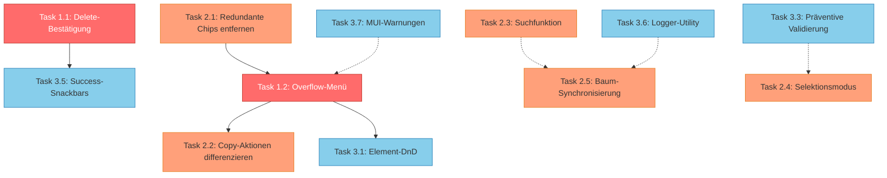

# UX-Audit Umsetzungsplan

**Basierend auf:** [`plans/ux-audit.md`](ux-audit.md)  
**Datum:** 21.02.2026  
**Scope:** Alle 22 Punkte (P0–P3), systematisch nach Priorität  

---

## Entscheidungsregister

| Thema | Entscheidung |
|-------|-------------|
| Löschen-Bestätigung | Bestätigungsdialog (nicht Soft-Delete) |
| DragIndicator | **Echtes Drag-and-Drop implementieren** (nicht entfernen) |
| Console.log | Logger-Utility erstellen (nur im Dev-Modus aktiv) |
| Scope | Alle P0–P3, P3 als optional markiert |
| Plan-Dateien | Werden nicht gelöscht, nur mit ✅ markiert |

---

## Phase 1: P0 — Kritisch

### Task 1.1: Bestätigungsdialog für Element-Löschen

**Problem:** [`ElementContextView.tsx:614`](../src/components/HybridEditor/ElementContextView.tsx:614) ruft `onRemoveElement(fullPath)` direkt ohne Bestätigung auf.

**Betroffene Dateien:**
- `src/components/HybridEditor/ElementContextView.tsx` — Dialog-State + Render
- Neuer Ordner/Datei nicht nötig, da der Dialog inline in ElementContextView implementiert werden kann

**Schritte:**
- [ ] Lokalen State `deleteConfirmOpen: boolean` und `deleteTargetPath: number[]` in [`ElementContextView`](../src/components/HybridEditor/ElementContextView.tsx:316) hinzufügen
- [ ] Delete-Button onClick: Statt `onRemoveElement(fullPath)` → Dialog öffnen mit Pfad speichern
- [ ] MUI `Dialog` rendern mit:
  - Titel: "Element löschen?"
  - Body: Element-Name + Warnung bei Container-Elementen: "Dieses Element enthält X Unterelemente, die ebenfalls gelöscht werden."
  - Buttons: "Abbrechen" + "Löschen" (rot, contained)
- [ ] Bei Bestätigung: `onRemoveElement(deleteTargetPath)` aufrufen + Dialog schließen
- [ ] Kinder-Zählung via `hasChildren()` + Unterelemente-Count (bereits in Zeile 729-746 vorhanden)

**Akzeptanzkriterien:**
- Klick auf Delete-Icon öffnet Bestätigungsdialog
- Dialog zeigt Element-Namen und Unterelemente-Warnung bei Containern
- "Abbrechen" schließt den Dialog ohne Aktion
- "Löschen" führt die Löschung durch

---

### Task 1.2: Overflow-Menü für Element-Aktionen (Header-Redesign)

**Problem:** Bis zu 10 Kontrollelemente im [`ElementHeader`](../src/components/HybridEditor/ElementContextView.tsx:475).

**Betroffene Dateien:**
- `src/components/HybridEditor/ElementContextView.tsx` — Header-Rendering komplett umstrukturieren

**Neue Header-Struktur:**

```
[Drag-Handle / Checkbox] [Icon] [Titel] [Container-Badge] [Visibility-Icon] [⋮ Overflow-Menü]
```

**Schritte:**
- [ ] MUI `Menu` + `IconButton` (MoreVertIcon) als Overflow-Menü pro Elementkarte hinzufügen
- [ ] Lokalen State für Menu-Anchor: `menuAnchorEl: Record<number, HTMLElement | null>`
- [ ] Folgende Aktionen in den **Header direkt** belassen:
  - DragIndicator / Checkbox (je nach Selektionsmodus)
  - Element-Typ-Icon + Titel
  - Container-Badge (nur Header-Chip, Content-Chip entfernen — siehe Task 2.1)
  - Visibility-Icon (wenn vorhanden)
- [ ] Folgende Aktionen ins **Overflow-Menü (⋮)** verschieben:
  - ↑ Nach oben verschieben
  - ↓ Nach unten verschieben
  - Duplizieren (`ContentCopyIcon`)
  - Zu anderer Seite kopieren (`FileCopyIcon`)
  - In Datei exportieren (`IosShareIcon`)
  - Löschen (`DeleteIcon`, rot)
- [ ] Overflow-Menü als `Menu` mit `MenuItem`-Komponenten (wie bei [`PageTab`](../src/components/PageNavigator/PageTab.tsx:228))
- [ ] Trennlinie (Divider) vor "Löschen" im Menü
- [ ] Menu-Items mit Icons und Text (z.B. `<ListItemIcon><ArrowUpwardIcon /></ListItemIcon><ListItemText>Nach oben</ListItemText>`)
- [ ] Deaktivierte Menüpunkte: "Nach oben" bei index === 0, "Nach unten" bei index === last

**Akzeptanzkriterien:**
- Header zeigt maximal 5 Elemente: Handle, Icon, Titel, Badge, Overflow
- Overflow-Menü enthält alle sekundären Aktionen
- Visuell deutlich aufgeräumter als vorher
- Alle Aktionen weiterhin erreichbar

---

## Phase 2: P1 — Hoch

### Task 2.1: Redundante Chips in ElementContent entfernen

**Problem:** Container-Typ wird dreifach dargestellt. Sichtbarkeitsregel und Element-Typ doppelt.

**Betroffene Dateien:**
- `src/components/HybridEditor/ElementContextView.tsx` — Content-Bereich bereinigen

**Schritte:**
- [ ] **Container-Chip aus Content entfernen:** Den Chip "Container: group/array/..." in Zeile 641-658 entfernen. Der Header-Chip (Zeile 494-513) bleibt.
- [ ] **Visibility-Chip aus Content entfernen:** Den Chip "Sichtbarkeitsregel" in Zeile 660-672 entfernen. Das Header-Icon (Zeile 516-523) bleibt.
- [ ] **pattern_type-Chip durch benutzerfreundlichen Label ersetzen:** Den Chip in Zeile 631-639 ändern:
  - Statt `elementType` → Benutzerfreundlichen Namen aus [`elementTypes`](../src/components/HybridEditor/ElementContextView.tsx:227) verwenden
  - Mapping-Funktion erstellen: `getElementTypeName(pattern_type) => string`
  - z.B. "TextUIElement" → "Text (Anzeige)", "StringUIElement" → "Texteingabe", "GroupUIElement" → "Gruppe"

**Akzeptanzkriterien:**
- Kein doppelter Container-Typ in der Karte
- Kein doppelter Visibility-Hinweis
- Element-Typ als benutzerfreundlicher Name statt technischem pattern_type

---

### Task 2.2: Differenziertere Copy-Aktionen im Overflow-Menü

**Problem:** Drei ähnliche Copy-Icons verursachen Verwirrung.

**Betroffene Dateien:**
- `src/components/HybridEditor/ElementContextView.tsx` — Menü-Items im Overflow

**Schritte:**
- [ ] Da die Copy-Aktionen nun im Overflow-Menü sind (Task 1.2), sind sie bereits durch **Text + Icon** differenziert
- [ ] Icons anpassen für bessere Unterscheidbarkeit:
  - Duplizieren: `ContentCopy` (bleibt)
  - Zu Seite kopieren: `DriveFileMoveOutlined` oder `FileCopy` (bleibt, da nun mit Text "Zu anderer Seite kopieren")
  - In Datei exportieren: `FileDownload` statt `IosShare`
- [ ] Menü-Gruppierung mit Divider:
  ```
  ↑ Nach oben verschieben
  ↓ Nach unten verschieben
  ─────────────────────
  Duplizieren
  Zu anderer Seite kopieren
  In Datei exportieren
  ─────────────────────
  Löschen
  ```

**Akzeptanzkriterien:**
- Alle drei Copy-Varianten klar durch Text unterscheidbar
- Icons visuell differenziert
- Logische Gruppierung im Menü

---

### Task 2.3: Suchfunktion im Hierarchie-Baum

**Problem:** Keine Möglichkeit, Elemente in großen Flows zu suchen.

**Betroffene Dateien:**
- `src/components/HybridEditor/ElementHierarchyTree.tsx` — Suchfeld + Filter-Logik
- `src/components/HybridEditor/HybridEditor.tsx` — Layout anpassen

**Schritte:**
- [ ] MUI `TextField` mit `InputAdornment` (SearchIcon) über dem Tree-Widget in [`ElementHierarchyTree`](../src/components/HybridEditor/ElementHierarchyTree.tsx) platzieren
- [ ] Lokaler State `searchTerm: string` in ElementHierarchyTree
- [ ] Filter-Logik: Rekursive Funktion, die Elemente nach `title.de`, `title.en`, `pattern_type` und `field_id.field_name` durchsucht
- [ ] Bei aktivem Suchterm: Nur übereinstimmende Elemente und deren Eltern anzeigen (Pfad zum Match erhalten)
- [ ] Highlight des Suchtreffers (z.B. fetter Text)
- [ ] "X Treffer" Anzeige unter dem Suchfeld
- [ ] Clear-Button (X) im Suchfeld zum Zurücksetzen

**Akzeptanzkriterien:**
- Suchfeld erscheint über dem Hierarchie-Baum
- Tippen filtert den Baum in Echtzeit
- Eltern-Container bleiben sichtbar, wenn Kinder matchen
- Leerer Suchterm zeigt den vollständigen Baum

---

### Task 2.4: Selektionsmodus prominenter gestalten

**Problem:** [`ChecklistIcon`](../src/components/HybridEditor/HybridEditor.tsx:510) ist schwer entdeckbar.

**Betroffene Dateien:**
- `src/components/HybridEditor/HybridEditor.tsx` — Breadcrumb-Bereich

**Schritte:**
- [ ] Den Selektionsmodus-Toggle von einem reinen IconButton zu einem Button mit Text erweitern:
  - Inaktiv: `<Button startIcon={<ChecklistIcon />} variant="text" size="small">Auswahl</Button>`
  - Aktiv: `<Button startIcon={<ChecklistIcon />} variant="contained" size="small" color="primary">Auswahl beenden</Button>`
- [ ] Alternativ bei schmalen Bildschirmen: Nur Icon mit Tooltip (responsive)
- [ ] Beim Aktivieren des Selektionsmodus: Info-Snackbar "Selektionsmodus aktiv — Klicken Sie Elemente an, um sie auszuwählen"

**Akzeptanzkriterien:**
- Selektionsmodus-Toggle hat beschrifteten Button-Text
- Aktiver/inaktiver Zustand visuell klar unterscheidbar
- Optional: Kurze Info-Nachricht beim Aktivieren

---

### Task 2.5: Baum-Karten-Synchronisierung verbessern

**Problem:** Komplexe `useEffect`-Logik in [`HybridEditor.tsx:133`](../src/components/HybridEditor/HybridEditor.tsx:133) mit inkonsistentem Verhalten.

**Betroffene Dateien:**
- `src/components/HybridEditor/HybridEditor.tsx` — `useEffect` Synchronisierung
- `src/components/HybridEditor/ElementHierarchyTree.tsx` — Auto-Scroll

**Schritte:**
- [ ] Klare Navigationsregel definieren und implementieren:
  - **Regel:** "Klick im Baum → mittlere Spalte zeigt IMMER den Parent-Kontext des geklickten Elements"
  - `currentPath = selectedElementPath.slice(0, -1)`
  - Wenn `selectedElementPath = []` → `currentPath = []`
- [ ] `useEffect`-Logik vereinfachen auf diese eine Regel (von ~40 Zeilen auf ~10)
- [ ] Auto-Scroll im Hierarchie-Baum zum aktuell ausgewählten Element (via `ref` + `scrollIntoView`)
- [ ] Entfernen der Debug-`console.log`-Statements in diesem Block (wird auch in Task 4.1 global adressiert)

**Akzeptanzkriterien:**
- Klick im Baum zeigt immer den korrekten Parent-Kontext in der Mitte
- Keine Race-Conditions oder inkonsistente States zwischen Baum und Karten
- Auto-Scroll zum selektierten Element im Baum

---

## Phase 3: P2 — Mittel

### Task 3.1: Element-Drag-and-Drop implementieren

**Problem:** [`DragIndicatorIcon`](../src/components/HybridEditor/ElementContextView.tsx:486) ist nur visuell, bietet keine DnD-Funktion.

**Betroffene Dateien:**
- `src/components/HybridEditor/ElementContextView.tsx` — `useDrag` + `useDrop` Hooks
- Kein neuer Reducer nötig — `onMoveElement` existiert bereits

**Referenz-Implementierung:** [`PageTab.tsx:68-131`](../src/components/PageNavigator/PageTab.tsx:68) (Drag-and-Drop für Seiten-Tabs)

**Schritte:**
- [ ] `ItemTypes.ELEMENT_CARD` Konstante definieren (analog zu `ItemTypes.PAGE_TAB`)
- [ ] Pro [`ElementCard`](../src/components/HybridEditor/ElementContextView.tsx:459):
  - `useDrag` Hook: Drag-Item = `{ index, path: fullPath, type: ItemTypes.ELEMENT_CARD }`
  - `useDrop` Hook: Accept `ItemTypes.ELEMENT_CARD`, hover-Logik für Reorder
  - Ref verbinden: `drag(drop(ref))`
- [ ] Visuelles Feedback:
  - Drag-Opacity: `opacity: isDragging ? 0.4 : 1`
  - Drop-Indikator: Highlight-Linie über/unter dem Hover-Target
- [ ] Bei Drop: `onMoveElement(dragIndex, hoverIndex, currentPath, sourcePath)` aufrufen
  - Top-Level: `onMoveElement(sourceIdx, targetIdx)`
  - Verschachtelt: `onMoveElement(sourceIdx, targetIdx, currentPath, fullSourcePath)`
- [ ] DragIndicator nur als Drag-Handle verwenden: `drag(dragHandleRef)` statt ganzer Karte
- [ ] Im Selektionsmodus DnD deaktivieren (Checkbox statt DragHandle)

**Akzeptanzkriterien:**
- DragIndicator fungiert als echtes Drag-Handle
- Elemente können per DnD innerhalb der gleichen Ebene umgeordnet werden
- Visuelles Feedback während des Ziehens
- Funktioniert sowohl auf Top-Level als auch in verschachtelten Containern
- Im Selektionsmodus wird DnD durch Checkbox ersetzt (bestehendes Verhalten)

---

### Task 3.2: Doppelklick-Drill-Down auf Container-Karten

**Problem:** Drill-Down erfordert das Finden des kleinen "Gruppe öffnen"-Buttons.

**Betroffene Dateien:**
- `src/components/HybridEditor/ElementContextView.tsx` — onClick-Handler erweitern

**Schritte:**
- [ ] `onDoubleClick`-Handler auf [`ElementCard`](../src/components/HybridEditor/ElementContextView.tsx:459) hinzufügen:
  ```tsx
  onDoubleClick={() => {
    if (canHaveChildren(elementType) && hasChildren(element)) {
      onDrillDown(fullPath);
    }
  }}
  ```
- [ ] "Öffnen"-Button in [`ElementActions`](../src/components/HybridEditor/ElementContextView.tsx:776) visuell prominenter gestalten:
  - Von `variant="outlined"` zu `variant="contained"` ändern
  - Hintergrundfarbe basierend auf Container-Typ
- [ ] Cursor auf Container-Karten: `cursor: 'pointer'` statt default

**Akzeptanzkriterien:**
- Doppelklick auf Container-Elemente führt zum Drill-Down
- Doppelklick auf Nicht-Container-Elemente hat keine Wirkung
- "Öffnen"-Button ist visuell auffälliger

---

### Task 3.3: Präventive Validierung im FloatingActionBar

**Problem:** Gruppierungs-Validierung erst nach Klick auf "Zusammenfassen".

**Betroffene Dateien:**
- `src/components/EditorArea/FloatingActionBar.tsx` — Button-Deaktivierung
- `src/components/HybridEditor/HybridEditor.tsx` — Validation-Props durchreichen
- `src/App.tsx` — Validierungs-Funktion als Prop

**Schritte:**
- [ ] Neue Prop `canWrapInGroup: boolean` und `wrapValidationError: string | null` in [`FloatingActionBar`](../src/components/EditorArea/FloatingActionBar.tsx:6)
- [ ] Validierungs-Funktion `validateGroupSelection(paths: number[][]): string | null` in App.tsx erstellen:
  - Extrahiert die 5 Prüfungen aus [`handleWrapInGroup`](../src/App.tsx:1934) in eine reine Funktion
  - Gibt `null` bei Erfolg oder Fehlermeldung als String zurück
- [ ] In HybridEditor: `useMemo` für `validationError = validateGroupSelection(selectedElementPaths)` bei jeder Änderung der Selektion
- [ ] "Zusammenfassen"-Button:
  - `disabled={!canWrapInGroup}`
  - `Tooltip` mit Fehlermeldung auf dem deaktivierten Button
- [ ] Fehlermeldung auch als kleiner Text unter dem Button-Count anzeigen

**Akzeptanzkriterien:**
- Button grau/deaktiviert, wenn Validierung fehlschlägt
- Tooltip zeigt den Grund für die Deaktivierung
- Validierung läuft bei jeder Selektion/Deselektion live

---

### Task 3.4: field_id in WrapInGroupDialog verstecken

**Problem:** Technische Details (UUID-basierte `field_id`) sind für Endbenutzer verwirrend.

**Betroffene Dateien:**
- `src/components/EditorArea/WrapInGroupDialog.tsx` — Layout anpassen

**Schritte:**
- [ ] `field_id`-TextField in einen aufklappbaren "Erweiterte Einstellungen"-Bereich verschieben:
  ```tsx
  <Accordion>
    <AccordionSummary expandIcon={<ExpandMoreIcon />}>
      <Typography variant="body2">Erweiterte Einstellungen</Typography>
    </AccordionSummary>
    <AccordionDetails>
      <TextField label="Field ID" ... />
    </AccordionDetails>
  </Accordion>
  ```
- [ ] Standardmäßig eingeklappt
- [ ] Auto-generierte field_id bleibt als Default

**Akzeptanzkriterien:**
- Nur der Gruppenname ist prominent sichtbar
- field_id ist unter "Erweiterte Einstellungen" versteckt
- Erfahrene Benutzer können die field_id bei Bedarf anpassen

---

### Task 3.5: Success-Snackbars für alle Aktionen

**Problem:** Keine Erfolgs-Rückmeldung bei den meisten Aktionen.

**Betroffene Dateien:**
- `src/App.tsx` — Snackbar-State + Feedback

**Schritte:**
- [ ] Generischen Success-Snackbar-State erstellen:
  ```ts
  const [successSnackbar, setSuccessSnackbar] = useState<{ open: boolean; message: string }>({ open: false, message: '' });
  ```
- [ ] Nach jeder erfolgreichen Aktion `setSuccessSnackbar` aufrufen:
  - "Element dupliziert" (nach `handleDuplicateElement`)
  - "Element auf Seite X kopiert" (nach `handleCopyElementToPageConfirm`)
  - "Element exportiert" (nach Export-Dialog)
  - "Gruppe erstellt" (nach `WRAP_IN_GROUP` dispatch)
  - "Gruppierung aufgelöst" (nach `UNGROUP` dispatch)
  - "Seiten importiert" (nach `IMPORT_PAGES` dispatch)
  - "Element gelöscht" (nach `onRemoveElement`) — mit Undo-Option
  - "Datei gespeichert" (nach Speichern)
- [ ] MUI `Snackbar` + `Alert` mit `severity="success"` rendern
- [ ] Auto-Hide nach 3 Sekunden

**Akzeptanzkriterien:**
- Jede erfolgreiche Aktion zeigt kurzes Feedback
- Snackbar verschwindet automatisch
- Nicht-störend (bottom-left oder bottom-center)

---

### Task 3.6: Logger-Utility erstellen und console.log ersetzen

**Problem:** Extensive `console.log`-Statements in Produktionscode.

**Betroffene Dateien:**
- **Neu:** `src/utils/logger.ts`
- **Alle Dateien** mit `console.log` — systematische Ersetzung

**Schritte:**
- [ ] `src/utils/logger.ts` erstellen:
  ```ts
  const isDev = process.env.NODE_ENV === 'development';

  export const logger = {
    log: (...args: any[]) => isDev && console.log(...args),
    warn: (...args: any[]) => isDev && console.warn(...args),
    error: (...args: any[]) => console.error(...args), // Errors immer loggen
    debug: (...args: any[]) => isDev && console.debug(...args),
  };
  ```
- [ ] Systematische Ersetzung in allen Dateien:
  - `src/components/HybridEditor/HybridEditor.tsx` — ~15 console.log → `logger.log`
  - `src/components/HybridEditor/ElementContextView.tsx` — ~10 console.log → `logger.log`
  - `src/context/EditorContext.tsx` — Reducer-Logging → `logger.log`
  - Alle weiteren Dateien mit console.log
- [ ] Import `import { logger } from '../utils/logger';` überall hinzufügen
- [ ] `console.error` für echte Fehler beibehalten (bereits im Logger als immer-aktiv definiert)

**Akzeptanzkriterien:**
- Kein `console.log` mehr in Produktionscode
- Im Development-Modus werden alle Logs weiterhin angezeigt
- Production-Build hat saubere Konsole (nur echte Errors)

---

### Task 3.7: MUI-Konsolen-Warnungen beheben

**Problem:** `<button>` in `<button>` und Tabs-Value-Mismatch.

**Betroffene Dateien:**
- `src/components/PageNavigator/PageTab.tsx` — button-in-button
- `src/components/PageNavigator/PageNavigator.tsx` — Tabs-Value Fallback

**Schritte:**
- [ ] **Button-in-Button (PageTab.tsx):**
  - [`PageTab`](../src/components/PageNavigator/PageTab.tsx:168) rendert `Tab` (= `button`) mit `icon` Prop = `IconButton` (= `button`)
  - Lösung: `IconButton` durch `Box` mit `onClick` und Icon ersetzen:
    ```tsx
    icon={
      !isLastPage ? (
        <Tooltip title="Seitenaktionen">
          <Box
            component="span"
            onClick={handleMenuOpen}
            sx={{ display: 'flex', cursor: 'pointer', p: 0.5 }}
          >
            <MoreVertIcon fontSize="small" />
          </Box>
        </Tooltip>
      ) : undefined
    }
    ```
- [ ] **Tabs-Value-Mismatch (PageNavigator.tsx):**
  - Fallback-Logik: Wenn `selectedPageId` keinem Tab-Value entspricht, auf den ersten verfügbaren Tab zurückfallen
  - `value={pages.some(p => p.id === selectedPageId) ? selectedPageId : (pages[0]?.id ?? false)}`

**Akzeptanzkriterien:**
- Keine `<button> cannot be descendant of <button>` Warnung
- Keine `MUI: The value provided to Tabs is invalid` Warnung

---

### Task 3.8: Tastaturkürzel implementieren

**Problem:** Keine Tastaturkürzel vorhanden.

**Betroffene Dateien:**
- `src/App.tsx` — globaler Keyboard-Handler

**Schritte:**
- [ ] `useEffect` mit `keydown`-Event-Listener in [`App.tsx`](../src/App.tsx):
  ```ts
  useEffect(() => {
    const handleKeyDown = (e: KeyboardEvent) => {
      // Nicht in Input-Feldern oder Textareas triggern
      if (['INPUT', 'TEXTAREA', 'SELECT'].includes((e.target as HTMLElement).tagName)) return;

      if (e.ctrlKey && e.key === 'z') { e.preventDefault(); handleUndo(); }
      if (e.ctrlKey && e.key === 'y') { e.preventDefault(); handleRedo(); }
      if (e.ctrlKey && e.key === 's') { e.preventDefault(); handleSave(); }
      if (e.key === 'Delete') { handleDeleteSelected(); }
      if (e.ctrlKey && e.key === 'd') { e.preventDefault(); handleDuplicateSelected(); }
      if (e.key === 'Escape' && state.isSelectionMode) { handleClearMultiSelect(); dispatch({ type: 'TOGGLE_SELECTION_MODE' }); }
    };
    window.addEventListener('keydown', handleKeyDown);
    return () => window.removeEventListener('keydown', handleKeyDown);
  }, [/* dependencies */]);
  ```
- [ ] `handleDeleteSelected` und `handleDuplicateSelected` Hilfsfunktionen basierend auf `selectedElementPath`
- [ ] Optional: Keyboard-Shortcut-Overlay (Modal) via `?`-Taste anzeigen

**Akzeptanzkriterien:**
- Ctrl+Z = Undo, Ctrl+Y = Redo, Ctrl+S = Speichern
- Delete = Ausgewähltes Element löschen (mit Bestätigungsdialog aus Task 1.1)
- Ctrl+D = Ausgewähltes Element duplizieren
- Escape = Selektionsmodus beenden
- Kürzel sind in Input-Feldern deaktiviert

---

### Task 3.9: Accessibility-Grundlagen

**Problem:** Fehlende ARIA-Labels, kleine Touch-Targets, kein Fokus-Management.

**Betroffene Dateien:**
- `src/components/HybridEditor/ElementContextView.tsx` — ARIA-Labels
- `src/components/HybridEditor/HybridEditor.tsx` — Fokus-Management
- `src/components/Navigation/Navigation.tsx` — ARIA-Landmarks

**Schritte:**
- [ ] **ARIA-Labels auf interaktiven Elementen:**
  - Overflow-Menü: `aria-label="Aktionen für {elementName}"`
  - Selektionsmodus-Toggle: `aria-label="Selektionsmodus umschalten"`
  - Breadcrumb-Container: `aria-label="Hierarchie-Navigation"`
  - Navigation: `role="banner"`, `aria-label="Hauptnavigation"`
- [ ] **Fokus-Management nach Drill-Down:**
  - Nach `handleDrillDown` in HybridEditor: `setTimeout(() => firstCardRef.current?.focus(), 100)`
  - TabIndex auf ElementCards: `tabIndex={0}`
- [ ] **Touch-Targets vergrößern:**
  - Overflow-Menü-Button: Mindestens `44px × 44px` (via `sx={{ minWidth: 44, minHeight: 44 }}`)
  - Alle Icon-Buttons: `size="medium"` statt `size="small"` in Bereichen mit Touch-Interaktion
- [ ] **Farbkontrast-Verbesserung:**
  - Container-Typ-Badges: Neben Farbe auch Text/Icon als Unterscheidungsmerkmal (bereits durch Text vorhanden ✓)

**Akzeptanzkriterien:**
- Alle interaktiven Elemente haben ARIA-Labels
- Navigation mit Tab-Taste funktioniert logisch
- Fokus springt nach Drill-Down zum Content-Bereich

---

## Phase 4: P3 — Nice-to-have (Optional)

### Task 4.1: Inkonsistente Grüntöne konsolidieren

**Betroffene Dateien:**
- Neue Datei: `src/theme/colors.ts` (oder in bestehendem Theme)
- Alle Dateien mit hartcodierten Farbwerten

**Schritte:**
- [ ] Zentrale Farbdefinitionen:
  ```ts
  export const colors = {
    primary: '#009F64',
    primaryHover: '#008D58',
    primaryLight: 'rgba(0, 159, 100, 0.1)',
    accent: '#43E77F',
    accentHover: '#35D870',
    // ...
  };
  ```
- [ ] Schrittweise Ersetzung in allen Komponenten

---

### Task 4.2: Erweiterte Empty State

**Betroffene Dateien:**
- `src/components/HybridEditor/ElementContextView.tsx` — EmptyState

**Schritte:**
- [ ] Quick-Actions im leeren Zustand:
  - "Element hinzufügen" (vorhanden ✓)
  - "JSON importieren" (Link zu Öffnen-Funktion)
  - "Beispiel-Flow laden" (neuer Button, optional)
- [ ] Kurze Erklärung der 3-Spalten-Struktur

---

### Task 4.3: Hinweis auf korrespondierende View-Page

**Betroffene Dateien:**
- `src/components/PageNavigator/EditPageDialog.tsx`

**Schritte:**
- [ ] Info-Box im EditPageDialog: "Änderungen an dieser Seite werden automatisch für die korrespondierende Ansichtsseite übernommen."

---

### Task 4.4: Bulk-Operationen im FloatingActionBar

**Betroffene Dateien:**
- `src/components/EditorArea/FloatingActionBar.tsx`
- `src/App.tsx`

**Schritte:**
- [ ] Zusätzliche Buttons im FloatingActionBar:
  - "Ausgewählte löschen" (mit Bestätigungsdialog)
  - "Ausgewählte duplizieren"
- [ ] Entsprechende Handler in App.tsx

---

## Abhängigkeiten und Reihenfolge



**Legende:** 🔴 P0 (kritisch) | 🟠 P1 (hoch) | 🔵 P2 (mittel)  
**Durchgezogene Pfeile:** Harte Abhängigkeit  
**Gestrichelte Pfeile:** Empfohlene Reihenfolge

---

## Empfohlene Umsetzungsreihenfolge

| Schritt | Task | Beschreibung | Betroffene Dateien |
|---------|------|-------------|-------------------|
| 1 | 3.6 | Logger-Utility erstellen | `src/utils/logger.ts` (neu) |
| 2 | 2.1 | Redundante Chips entfernen | `ElementContextView.tsx` |
| 3 | 1.2 | Overflow-Menü implementieren | `ElementContextView.tsx` |
| 4 | 2.2 | Copy-Aktionen im Menü differenzieren | `ElementContextView.tsx` |
| 5 | 1.1 | Delete-Bestätigungsdialog | `ElementContextView.tsx` |
| 6 | 3.1 | Element-Drag-and-Drop | `ElementContextView.tsx` |
| 7 | 3.6b | console.log systematisch ersetzen | Alle betroffenen Dateien |
| 8 | 3.7 | MUI-Konsolen-Warnungen | `PageTab.tsx`, `PageNavigator.tsx` |
| 9 | 2.3 | Suchfunktion im Baum | `ElementHierarchyTree.tsx` |
| 10 | 2.5 | Baum-Synchronisierung | `HybridEditor.tsx` |
| 11 | 2.4 | Selektionsmodus prominent | `HybridEditor.tsx` |
| 12 | 3.2 | Doppelklick-Drill-Down | `ElementContextView.tsx` |
| 13 | 3.3 | Präventive Validierung | `FloatingActionBar.tsx`, `App.tsx` |
| 14 | 3.4 | field_id verstecken | `WrapInGroupDialog.tsx` |
| 15 | 3.5 | Success-Snackbars | `App.tsx` |
| 16 | 3.8 | Tastaturkürzel | `App.tsx` |
| 17 | 3.9 | Accessibility | Mehrere Dateien |
| 18 | 4.1 | Farben konsolidieren | `src/theme/colors.ts` (neu) |
| 19 | 4.2 | Erweiterte Empty State | `ElementContextView.tsx` |
| 20 | 4.3 | View-Page-Hinweis | `EditPageDialog.tsx` |
| 21 | 4.4 | Bulk-Operationen | `FloatingActionBar.tsx`, `App.tsx` |
