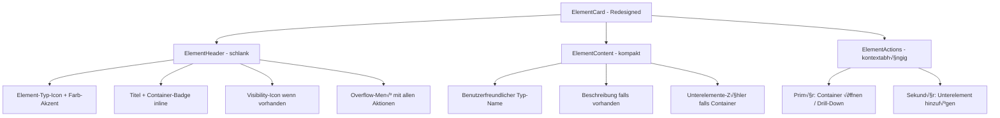

# UX-Audit: Flow UI Toolkit Editor

**Datum:** 21.02.2026  
**Scope:** Gesamtanwendung — alle Komponenten, Dialoge, Interaktionsmuster  
**Methodik:** Systematische Code-Analyse + visuelle Inspektion aller Kernkomponenten  

---

## √úberblick der Anwendung

Das Flow UI Toolkit ist ein 3-Spalten-Editor zum Erstellen und Bearbeiten von JSON-basierten Formular-Flows. Die Architektur besteht aus:

- **Navigation** (obere Leiste): Neu, Öffnen, Speichern, Workflow-Name, Hilfe, Undo/Redo
- **PageNavigator** (Tabs): Seiten-Tabs mit Drag-and-Drop, +Seite, Import
- **HybridEditor** (3-Spalten):
  - **Links** (260px): Element-Hierarchie-Baum
  - **Mitte**: ElementContextView — Elementkarten mit Aktionen
  - **Rechts**: EnhancedPropertyEditor — Eigenschaften, Sichtbarkeit, JSON-Vorschau

---

## 1. Intuitivität & Erlernbarkeit

### 1.1 Elementkarten-Header — Kognitive Überladung ✅ **P0** [ERLEDIGT]

**Befund:** Jeder [`ElementHeader`](src/components/HybridEditor/ElementContextView.tsx:79) rendert bis zu **10 interaktive Kontrollelemente** in einer einzigen Zeile:

**Status:** Gelöst durch Overflow-Menü (⋮) mit gruppierten Aktionen. Nur DragIndicator, Icon, Titel und ⋮-Button im Header.

1. DragIndicator / Checkbox (je nach Selektionsmodus)
2. Element-Typ-Icon
3. Element-Titel
4. Container-Typ-Chip (bei Container-Elementen)
5. Visibility-Icon (bei Sichtbarkeitsregel)
6. Pfeil nach oben (wenn nicht erstes Element)
7. Pfeil nach unten (wenn nicht letztes Element)
8. ContentCopy — Duplizieren
9. FileCopy — Zu anderer Seite kopieren
10. IosShare — In andere JSON-Datei exportieren
11. Delete — Löschen

**Problem:** Bei einem Container-Element mit Sichtbarkeitsregel und mittlerer Position in der Liste werden **8+ Icons nebeneinander** dargestellt. Auf kleineren Bildschirmen oder bei langen Titeln entsteht visuelles Chaos.

**Empfehlung:** 
- Nur die 3 häufigsten Aktionen direkt zeigen (z.B. Verschieben-Pfeile, Löschen)
- Restliche Aktionen in ein Overflow-Menü (⋮) wie bei [`PageTab`](src/components/PageNavigator/PageTab.tsx:203) auslagern
- Alternativ: Aktionen nur bei Hover über der Karte einblenden

### 1.2 Selektionsmodus — Versteckte Funktion ✅ **P1** [ERLEDIGT]

**Befund:** Der [`ChecklistIcon`](src/components/HybridEditor/HybridEditor.tsx:510) als Toggle für den Selektionsmodus ist:
- Ein einzelnes Icon ohne Beschriftung
- Nicht sofort als "Selektionsmodus" erkennbar
- Platziert neben Back/Home-Navigation — leicht zu übersehen

**Status:** Gelöst durch prominenten Chip "Selektion aktiv" mit Icon im aktiven Zustand. Im inaktiven Zustand Tooltip mit erklärendem Text.

### 1.3 DragIndicator ist irreführend ✅ **P2** [ERLEDIGT]

**Befund:** Das [`DragIndicatorIcon`](src/components/HybridEditor/ElementContextView.tsx:486) wird in jeder Elementkarte angezeigt (außer im Selektionsmodus), aber Element-Drag-and-Drop ist **nicht implementiert**. Elemente können nur über Pfeil-Buttons verschoben werden.

**Status:** Gelöst durch vollständige Element-DnD-Implementierung mit `useDrag`/`useDrop` Hooks. DragIndicator ist nun funktionales Drag-Handle.

### 1.4 Drill-Down-Navigation — Nicht offensichtlich ✅ **P2** [ERLEDIGT]

**Befund:** Um in die Kinder eines Container-Elements zu navigieren, muss der Nutzer den Button ["Gruppe öffnen"](src/components/HybridEditor/ElementContextView.tsx:804) / "Array öffnen" in der Karten-Fußzeile finden und klicken.

**Status:** Gelöst durch Doppelklick-Drill-Down auf der gesamten Elementkarte.

### 1.5 Leerer Zustand — Minimale Hilfestellung ⚠️ **P3**

**Befund:** Der [`EmptyState`](src/components/HybridEditor/ElementContextView.tsx:922) zeigt nur:
> "Keine Elemente in dieser Ebene — Fügen Sie ein neues Element hinzu, um zu beginnen."

**Problem:** Kein Onboarding, keine Erklärung der 3-Spalten-Struktur, keine Hinweise auf Import-Möglichkeiten.

**Empfehlung:**
- Erweiterte Empty State mit Quick-Actions: "Element hinzufügen", "JSON importieren", "Beispiel-Flow laden"
- Optionaler Onboarding-Walkthrough für Erstbenutzer

---

## 2. Redundanzen & Inkonsistenzen

### 2.1 Container-Typ dreifach dargestellt ⚠️ **P1**

**Befund:** Für Container-Elemente (Group, Array, ChipGroup, Custom) wird der Container-Typ an **drei Stellen** gleichzeitig kommuniziert:

| Ort | Darstellung | Code |
|-----|-------------|------|
| Header-Hintergrund | Farb-Akzent via [`getElementColor()`](src/components/HybridEditor/ElementContextView.tsx:192) | `rgba(0,159,100,0.05)` für Group |
| Header-Chip | Badge "group" / "array" / etc. | [Zeile 494-513](src/components/HybridEditor/ElementContextView.tsx:494) |
| Content-Chip | "Container: group" | [Zeile 641-658](src/components/HybridEditor/ElementContextView.tsx:641) |

**Problem:** Dreifache Redundanz ohne Informationsgewinn. Verschwendet vertikalen Platz und erzeugt visuelles Rauschen.

**Empfehlung:**
- Header-Hintergrundfarbe beibehalten (subtil, effektiv)
- **Einen** der beiden Chips entfernen — vorzugsweise den Content-Chip, da der Header-Chip prominenter ist
- Container-Typ auch über das Element-Icon differenzieren (bereits vorhanden via [`getElementIcon()`](src/components/HybridEditor/ElementContextView.tsx:151))

### 2.2 Sichtbarkeitsregel doppelt dargestellt ⚠️ **P2**

**Befund:** Elemente mit `visibility_condition` zeigen die Information doppelt:
1. **Header:** [`VisibilityIcon`](src/components/HybridEditor/ElementContextView.tsx:516) — kleines Augen-Icon
2. **Content:** [`Chip "Sichtbarkeitsregel"`](src/components/HybridEditor/ElementContextView.tsx:660) — mit Icon und Text

**Empfehlung:** Nur das Header-Icon behalten. Der Content-Chip bietet keinen Mehrwert gegenüber dem Icon + Tooltip.

### 2.3 Drei ähnliche Copy-Aktionen ⚠️ **P1**

**Befund:** Im Header jeder Elementkarte erscheinen drei visuell ähnliche Icons:

| Icon | Aktion | Tooltip |
|------|--------|---------|
| `ContentCopyIcon` | Duplizieren | "Duplizieren" |
| `FileCopyIcon` | Zu anderer Seite kopieren | "Zu anderer Seite kopieren" |
| `IosShareIcon` | In andere JSON-Datei exportieren | "In andere JSON-Datei exportieren" |

**Problem:** 
- `ContentCopyIcon` und `FileCopyIcon` sind bei kleiner Größe kaum unterscheidbar
- Drei Copy-Varianten nebeneinander erzeugen Verwirrung: "Welches Icon macht was?"
- `IosShareIcon` (iOS-Share-Symbol) passt semantisch nicht zu "Export in Datei"

**Empfehlung:**
- Nur "Duplizieren" im Header belassen
- "Zu Seite kopieren" und "In Datei exportieren" in ein Overflow-Menü (⋮) oder in den Property-Editor verschieben
- Alternative Icons: `ContentCopy` für Duplicate, `DriveFileMoveOutlined` für Copy-to-Page, `FileDownload` für Export

### 2.4 Element-Typ doppelt dargestellt ⚠️ **P3**

**Befund:** 
1. **Header:** Element-Typ-Icon (z.B. TextFieldsIcon für TextUIElement)
2. **Content:** Chip mit dem `pattern_type`-String (z.B. "TextUIElement")

**Problem:** Der technische String "TextUIElement" ist für Endbenutzer nicht aussagekräftig. Das Icon allein kommuniziert den Typ besser.

**Empfehlung:** 
- Den pattern_type-Chip entweder entfernen oder durch einen benutzerfreundlichen Label ersetzen (z.B. "Text" statt "TextUIElement")
- Mapping bereits vorhanden in [`elementTypes`](src/components/HybridEditor/ElementContextView.tsx:227): `TextUIElement` ‚Üí "Text (Anzeige)"

### 2.5 Inkonsistente Grüntöne ⚠️ **P3**

**Befund:** Mindestens **5 verschiedene Grüntöne** werden verwendet:

| Hex | Kontext |
|-----|---------|
| `#009F64` | Primärfarbe Navigation, Gruppen-Farbe, Dialoge |
| `#43E77F` | "Element hinzufügen"-Button |
| `#35D870` | Hover auf "Element hinzufügen" |
| `#007A4D` | Hover in Dialogen |
| `#008D58` | Hover in Navigation |

**Empfehlung:** Auf maximal 3 Grüntöne reduzieren (Primary, Hover, Light) und als Theme-Variablen definieren.

---

## 3. Verständlichkeit der Logik & Mentales Modell

### 3.1 Hierarchie-Navigation — Zwei Modelle konkurrieren ⚠️ **P1**

**Befund:** Die linke Spalte ([`ElementHierarchyTree`](src/components/HybridEditor/ElementHierarchyTree.tsx)) und die mittlere Spalte ([`ElementContextView`](src/components/HybridEditor/ElementContextView.tsx)) zeigen unterschiedliche Perspektiven der gleichen Daten:

- **Links:** Vollständiger Baum mit allen Ebenen gleichzeitig sichtbar
- **Mitte:** Nur Kinder der aktuellen `currentPath`-Ebene als Karten

Ein Klick im Baum ändert `selectedElementPath`, was `currentPath` in bestimmten Fällen anpasst — aber nicht immer konsistent (siehe [`useEffect` in HybridEditor](src/components/HybridEditor/HybridEditor.tsx:133)).

**Problem:** 
- Nutzer können in eine Situation geraten, wo der Baum ein Element markiert hat, das in der Mitte nicht sichtbar ist
- Die Logik zur Synchronisierung zwischen Tree-Selection und Card-View ist komplex (56 Zeilen `useEffect`)
- Zahlreiche `console.log`-Statements deuten auf Debug-Schwierigkeiten hin

**Empfehlung:**
- Klare Regel definieren: "Klick im Baum ‚Üí mittlere Spalte zeigt **immer** den Parent-Kontext des geklickten Elements"
- Visuellen Indikator in der Mitte, welches Element auch im Baum markiert ist
- Auto-Scroll zum markierten Element im Baum

### 3.2 Validierungsregeln für Gruppierung — Nur reaktiv ⚠️ **P2**

**Befund:** Die 5 Validierungsregeln in [`handleWrapInGroup()`](src/App.tsx:1934) werden **erst nach dem Klick** auf "Zusammenfassen" geprüft:
1. Gleiche Elternebene
2. Nicht in SubFlow
3. Nicht in ArrayUIElement
4. Nicht in ChipGroupUIElement
5. Kein GroupUIElement in Selektion

**Problem:** Der Nutzer erfährt erst nach dem Versuch, warum die Gruppierung fehlschlägt. Die Fehlermeldungen sind zwar verständlich, aber reaktiv statt präventiv.

**Empfehlung:**
- "Zusammenfassen"-Button im [`FloatingActionBar`](src/components/EditorArea/FloatingActionBar.tsx:47) deaktivieren, wenn Validierung fehlschlägt
- Tooltip auf dem deaktivierten Button mit dem Grund anzeigen
- Optional: Nicht-gruppierbare Elemente visuell kennzeichnen (z.B. ausgegraut im Selektionsmodus)

### 3.3 Technische Details lecken durch ⚠️ **P2**

**Befund:** Mehrere Stellen zeigen technische Interna, die Endbenutzer nicht verstehen müssen:

| Stelle | Detail | Code |
|--------|--------|------|
| [`WrapInGroupDialog`](src/components/EditorArea/WrapInGroupDialog.tsx:75) | `field_id` als editierbares Feld mit UUID | `groupuielement_<uuid>` |
| [`ElementContextView`](src/components/HybridEditor/ElementContextView.tsx:698) | `field_id.field_name` in Elementkarten | Monospace-Text |
| [`EnhancedPropertyEditor`](src/components/HybridEditor/EnhancedPropertyEditor.tsx:168) | Feld-ID als TextField | Direkte Bearbeitung |
| Breadcrumbs | Container-Type-Label "group", "array", "chipgroup" | Technische Bezeichner |

**Empfehlung:**
- `field_id` im WrapInGroupDialog nur als "Erweitert"-Sektion zeigen (eingeklappt)
- Container-Typ-Labels in benutzerfreundliche Bezeichnungen umwandeln: "Gruppe", "Array-Liste", "Chip-Auswahl", "Benutzerdefiniert"
- `field_id` in Elementkarten nur im "Entwickler-Modus" anzeigen

### 3.4 Löschen ohne Bestätigung ⚠️ **P0**

**Befund:** Der [`Delete`-Button](src/components/HybridEditor/ElementContextView.tsx:614) in der Elementkarte ruft direkt `onRemoveElement(fullPath)` auf — **ohne Bestätigungsdialog**.

**Problem:** Ein versehentlicher Klick auf das rote Mülleimer-Icon löscht das Element sofort. Bei Container-Elementen gehen auch alle Kinder verloren. Zwar existiert Undo, aber der Nutzer bemerkt den Verlust möglicherweise nicht sofort.

**Empfehlung:**
- Bestätigungsdialog für alle Löschaktionen
- Besonders wichtig bei Container-Elementen: "Dieses Element enthält X Unterelemente. Wirklich löschen?"
- Alternativ: "Soft Delete" mit Snackbar + Undo-Button (Gmail-Pattern)

### 3.5 Pages-Pairing-Modell unsichtbar ⚠️ **P3**

**Befund:** `pages_edit` und `pages_view` werden intern als Paare verwaltet (via `related_pages` und ID-Konvention `edit-<uuid>` ‚Üî `view-<uuid>`), aber der Nutzer sieht nur die Edit-Pages.

**Problem:** Änderungen an einer Edit-Page können Auswirkungen auf die korrespondierende View-Page haben, ohne dass dies transparent ist.

**Empfehlung:** Hinweis in der Seitenbearbeitung, dass eine korrespondierende View-Page existiert und automatisch synchronisiert wird.

---

## 4. Fehlende Elemente & Verbesserungspotenzial

### 4.1 Keine Suchfunktion ⚠️ **P1**

**Befund:** Bei Flows mit dutzenden Seiten und hunderten Elementen gibt es **keinen Suchfilter**. Weder für Elemente (nach Name, Typ, field_id) noch für Seiten.

**Empfehlung:**
- Suchfeld über dem [`ElementHierarchyTree`](src/components/HybridEditor/ElementHierarchyTree.tsx) (linke Spalte)
- Filter nach Element-Typ, Sichtbarkeitsregel, Container-Typ
- Globale Suche über alle Seiten hinweg

### 4.2 Keine Tastaturkürzel ⚠️ **P2**

**Befund:** Keine Tastaturkürzel implementiert oder dokumentiert. Alle Aktionen erfordern Mausinteraktion.

**Empfehlung:**
- `Ctrl+Z` / `Ctrl+Y` für Undo/Redo (wahrscheinlich bereits über Browser-Default?)
- `Ctrl+S` für Speichern
- `Delete` / `Entf` für ausgewähltes Element löschen
- `Escape` für Selektionsmodus beenden
- `Ctrl+D` für Duplizieren
- Keyboard-Shortcut-Overlay via `?`-Taste

### 4.3 Kein Vorschau-Modus ⚠️ **P2**

**Befund:** Es gibt keine Möglichkeit, den Flow so zu sehen, wie er in der doorbit App oder doorbit Web dargestellt wird.

**Empfehlung:** Einfache Vorschau-Ansicht, die die Formular-Elemente in ihrer Zieldarstellung rendert (Read-Only).

### 4.4 Keine Erfolgs-Rückmeldung bei Aktionen ⚠️ **P2**

**Befund:** 
- Speichern löst nur einen Datei-Download aus — keine visuelle Bestätigung
- Duplizieren hat kein Feedback
- Element hinzufügen hat kein Feedback
- Nur Fehler bei Gruppierung zeigen eine Snackbar

**Empfehlung:** Konsistente Success-Snackbars für alle Aktionen: "Element dupliziert", "Auf Seite X kopiert", "Gruppe erstellt", "Gespeichert".

### 4.5 Konsolen-Logging in Produktion ⚠️ **P2**

**Befund:** Zahlreiche `console.log`-Statements in Produktionscode:
- [`HybridEditor.tsx`](src/components/HybridEditor/HybridEditor.tsx:134): 15+ console.log-Aufrufe
- [`ElementContextView.tsx`](src/components/HybridEditor/ElementContextView.tsx:370): console.log in `getDisplayName`, `hasChildren`, `renderElementCards`
- [`EditorContext.tsx`](src/context/EditorContext.tsx): Logging in Reducer-Actions

**Problem:** Performance-Impact, unaufgeräumter Konsolenoutput, potenzielles Leaking sensibler Daten.

**Empfehlung:** 
- Alle `console.log` durch eine Logger-Utility ersetzen, die nur im Development-Modus aktiv ist
- Oder: Alle Debug-Logs vor dem Produktions-Build entfernen

### 4.6 MUI-Warnungen in der Konsole ⚠️ **P2**

**Befund:** Bekannte Konsolen-Fehler:
- `<button> cannot be a descendant of <button>` — verursacht durch [`PageTab`](src/components/PageNavigator/PageTab.tsx:168), wo ein MUI `Tab` (button) ein `IconButton` (button) enthält
- `MUI: The value provided to Tabs component is invalid` — Seiten-ID-Mismatch

**Empfehlung:**
- PageTab: `IconButton` durch ein `Box` mit onClick ersetzen, um die Button-in-Button-Verschachtelung zu vermeiden
- Tabs-Wert-Mismatch: Fallback-Logik implementieren, die bei fehlender Seiten-ID auf den ersten Tab zurückfällt

### 4.7 Accessibility-Lücken ⚠️ **P2**

**Befund:**
- Keine Skip-Links für Tastaturnavigation
- Farbcodierung der Container-Typen als einziges Unterscheidungsmerkmal (Farb-Kontrast-Problem)
- Viele Icon-Buttons ohne ARIA-Labels (nur Tooltips)
- Kein Fokus-Management nach Drill-Down (Fokus bleibt am vorherigen Element)
- Kleine Touch-Targets: `size="small"` auf den meisten IconButtons

**Empfehlung:**
- ARIA-Labels auf allen interaktiven Elementen
- Fokus-Management nach Navigation (Drill-Down, Breadcrumb-Klick)
- Farbcodierung mit zusätzlichem Text/Icon-Unterscheidungsmerkmal ergänzen
- Mindest-Touch-Target von 44x44px für mobile Nutzung

### 4.8 Keine Bulk-Operationen über Gruppierung hinaus ⚠️ **P3**

**Befund:** Multi-Selektion unterstützt nur "Zu Gruppe zusammenfassen". Weitere Bulk-Aktionen fehlen:
- Bulk-Löschen
- Bulk-Verschieben
- Bulk-Duplizieren
- Bulk-Sichtbarkeitsregel setzen

**Empfehlung:** Die bestehende Multi-Selektion-Infrastruktur (`selectedElementPaths`) als Basis für weitere Bulk-Aktionen nutzen.

---

## 5. Gesamtbewertung & Priorisierte Empfehlungen

### Stärken der aktuellen UX

1. **Klare 3-Spalten-Struktur**: Hierarchie → Kontext → Eigenschaften ist ein bewährtes Pattern
2. **Breadcrumb-Navigation**: Gute Orientierung in verschachtelten Strukturen
3. **Farbkodierung der Container-Typen**: Visuell schnell unterscheidbar
4. **Dialogdesign**: WrapInGroupDialog, CopyElementToPageDialog und ExportElementToFileDialog sind klar strukturiert
5. **Undo/Redo**: Konsistent implementiert über alle Aktionen
6. **Selektionsmodus**: Saubere Trennung von Einzel- und Multi-Selektion
7. **Visibility Legend**: Kompakte Erklärung der Sichtbarkeitsregeln

### Priorisierte Empfehlungen

#### P0 — Kritisch (Datenverlust-Risiko / Major Blocker)

| # | Problem | Empfehlung | Betroffene Datei |
|---|---------|------------|------------------|
| 1 | **Löschen ohne Bestätigung** | Bestätigungsdialog oder Soft-Delete mit Undo-Snackbar | [`ElementContextView.tsx`](src/components/HybridEditor/ElementContextView.tsx:614) |
| 2 | **Elementkarten-Header überladen** | Overflow-Menü (⋮) für sekundäre Aktionen | [`ElementContextView.tsx`](src/components/HybridEditor/ElementContextView.tsx:475) |

#### P1 — Hoch (Signifikante Frustration / Effizienz-Verlust)

| # | Problem | Empfehlung | Betroffene Datei |
|---|---------|------------|------------------|
| 3 | **Container-Typ dreifach redundant** | Einen der Content-Chips entfernen | [`ElementContextView.tsx`](src/components/HybridEditor/ElementContextView.tsx:641) |
| 4 | **Drei ähnliche Copy-Icons** | Overflow-Menü oder differenziertere Icons | [`ElementContextView.tsx`](src/components/HybridEditor/ElementContextView.tsx:571) |
| 5 | **Keine Suchfunktion** | Suchfeld über dem Hierarchie-Baum | [`ElementHierarchyTree.tsx`](src/components/HybridEditor/ElementHierarchyTree.tsx) |
| 6 | **Selektionsmodus schwer entdeckbar** | Text-Label + prominentere Platzierung | [`HybridEditor.tsx`](src/components/HybridEditor/HybridEditor.tsx:497) |
| 7 | **Baum-Karten-Synchronisierung** | Klare Navigationsregeln + Scroll-to-Selection | [`HybridEditor.tsx`](src/components/HybridEditor/HybridEditor.tsx:133) |

#### P2 — Mittel (Ärgerlich, Workaround existiert)

| # | Problem | Empfehlung | Betroffene Datei |
|---|---------|------------|------------------|
| 8 | **DragIndicator irreführend** | Icon entfernen oder DnD implementieren | [`ElementContextView.tsx`](src/components/HybridEditor/ElementContextView.tsx:486) |
| 9 | **Drill-Down nicht intuitiv** | Doppelklick als Shortcut + prominenterer Button | [`ElementContextView.tsx`](src/components/HybridEditor/ElementContextView.tsx:776) |
| 10 | **Validierung nur reaktiv** | Button deaktivieren + Tooltip-Begründung | [`FloatingActionBar.tsx`](src/components/EditorArea/FloatingActionBar.tsx:47) |
| 11 | **Technische Details sichtbar** | field_id in Erweitert-Sektion verstecken | [`WrapInGroupDialog.tsx`](src/components/EditorArea/WrapInGroupDialog.tsx:75) |
| 12 | **Keine Erfolgs-Rückmeldung** | Success-Snackbars für alle Aktionen | [`App.tsx`](src/App.tsx) |
| 13 | **Console.log in Produktion** | Logger-Utility oder Build-Time-Removal | Mehrere Dateien |
| 14 | **MUI-Konsolen-Warnungen** | button-in-button und Tabs-Value fixen | [`PageTab.tsx`](src/components/PageNavigator/PageTab.tsx:168) |
| 15 | **Keine Tastaturkürzel** | Ctrl+Z, Ctrl+S, Delete etc. | Global |
| 16 | **Accessibility-Lücken** | ARIA-Labels, Fokus-Management, Touch-Targets | Mehrere Dateien |

#### P3 — Niedrig (Nice-to-have)

| # | Problem | Empfehlung |
|---|---------|------------|
| 17 | **Sichtbarkeitsregel doppelt** | Content-Chip entfernen |
| 18 | **Element-Typ doppelt** | pattern_type-Chip durch benutzerfreundlichen Label ersetzen |
| 19 | **Inkonsistente Grüntöne** | Theme-Variablen für max. 3 Abstufungen |
| 20 | **Leerer Zustand minimal** | Erweiterte Empty State mit Quick-Actions |
| 21 | **Pages-Pairing unsichtbar** | Hinweis auf korrespondierende View-Page |
| 22 | **Keine Bulk-Operationen** | Bulk-Delete, -Move, -Duplicate auf bestehender Infrastruktur |

---

## Architektur-Diagramm: Informationsfluss in der Elementkarte

```mermaid
graph TD
    A[ElementCard] --> B[ElementHeader]
    A --> C[ElementContent]
    A --> D[ElementActions]
    
    B --> B1[DragIndicator ODER Checkbox]
    B --> B2[Element-Typ-Icon]
    B --> B3[Titel]
    B --> B4[Container-Chip *redundant*]
    B --> B5[Visibility-Icon *redundant*]
    B --> B6[ArrowUp / ArrowDown]
    B --> B7[Duplicate]
    B --> B8[CopyToPage]
    B --> B9[ExportToFile]
    B --> B10[Delete]
    
    C --> C1[pattern_type Chip *redundant mit B2*]
    C --> C2[Container Chip *redundant mit B4*]
    C --> C3[Visibility Chip *redundant mit B5*]
    C --> C4[field_id / IDs]
    C --> C5[Beschreibung]
    C --> C6[Unterelemente-Zähler]
    
    D --> D1[Unterelement hinzufügen]
    D --> D2[Container öffnen / Drill-Down]
    D --> D3[Gruppierung auflösen]
    
    style B4 fill:#ff9999,stroke:#cc0000
    style C2 fill:#ff9999,stroke:#cc0000
    style B5 fill:#ffcc99,stroke:#cc6600
    style C3 fill:#ffcc99,stroke:#cc6600
    style C1 fill:#ffcc99,stroke:#cc6600
```

Die rot markierten Elemente sind **redundant** und sollten entfernt werden, um die visuelle Dichte zu reduzieren.

---

## Vorgeschlagene Elementkarten-Neugestaltung

**Kernprinzip:** Maximal 4 Elemente im Header, Rest im Overflow-Menü. Content zeigt nur einzigartige Informationen.

---

## Umsetzungs-Roadmap

### Phase 1: Quick Wins
- [ ] Bestätigungsdialog für Löschen hinzufügen
- [ ] DragIndicatorIcon entfernen oder ersetzen
- [ ] Redundanten Container-Chip aus Content entfernen
- [ ] Redundanten Visibility-Chip aus Content entfernen
- [ ] pattern_type-Chip durch benutzerfreundlichen Label ersetzen
- [ ] console.log-Statements entfernen oder durch Logger ersetzen

### Phase 2: Header-Redesign
- [ ] Overflow-Menü (⋮) für sekundäre Aktionen implementieren
- [ ] Nur Verschieben + Löschen direkt im Header
- [ ] Duplizieren, CopyToPage, ExportToFile ins Overflow-Menü
- [ ] MUI button-in-button Warning in PageTab fixen

### Phase 3: Navigation & Discovery
- [ ] Suchfunktion im Hierarchie-Baum
- [ ] Doppelklick-Drill-Down auf Container-Karten
- [ ] Selektionsmodus prominenter gestalten
- [ ] Success-Snackbars für alle Aktionen
- [ ] Tastaturkürzel implementieren

### Phase 4: Polish & Accessibility
- [ ] ARIA-Labels auf allen interaktiven Elementen
- [ ] Fokus-Management nach Navigation
- [ ] Touch-Targets vergrößern
- [ ] Grüntöne konsolidieren
- [ ] Onboarding-Walkthrough für Erstbenutzer
- [ ] Validierung präventiv statt reaktiv

---

## Umsetzungsstatus (Stand 21.02.2026 22:23)

### Erledigte Tasks ?

**Phase 1 (P0 - Blocker)**
- ? **1.1** Elementkarten-Header ó Overflow-Men¸ implementiert
- ? **3.4** Lˆschen ohne Best‰tigung ó Best‰tigungsdialog mit Warnungen implementiert

**Phase 2 (P1 - Critical UX)**
- ? **1.2** Selektionsmodus ó Prominenten Chip 'Selektion aktiv' hinzugef¸gt
- ? **2.3** Drei Copy-Aktionen ó Icons differenziert, im Overflow-Men¸ gruppiert
- ? **2.1** Container-Typ-Chip ó Entfernt (redundant)
- ? **2.2** Sichtbarkeitsregel-Chip ó Entfernt (redundant)
- ? **4.1** Keine Suchfunktion ó Suchfeld im Hierarchie-Baum mit Auto-Expand implementiert

**Phase 3 (P2 - Major UX)**
- ? **1.3** DragIndicator irref¸hrend ó Vollst‰ndiges Element-DnD mit useDrag/useDrop implementiert
- ? **1.4** Drill-Down-Navigation ó Doppelklick-Shortcut implementiert
- ? **3.3** Technische Details ó field_id hinter Accordion versteckt (WrapInGroupDialog)
- ? **4.2** Keine Tastaturk¸rzel ó Ctrl+Z/Y/S, Escape implementiert
- ? **4.3** Fehlende Erfolgsmeldungen ó Success-Snackbars f¸r alle Aktionen
- ? **4.5** Console-Log-Statements ó Logger-Utility erstellt und durchgehend verwendet
- ? **4.6** MUI Console Warnings ó Button-in-Button und Tabs-Warnungen behoben

### Ausstehende Tasks ??

**Phase 2 (P1)**
- ?? **3.1** Tree-Card-Synchronisation ó useEffect-Logik vereinfachen

**Phase 3 (P2)**
- ?? **3.2** Validierungsregeln ó Pr‰ventive Validierung in FloatingActionBar
- ?? **4.4** Accessibility ó ARIA-Labels, Fokusreihenfolge, Touch-Targets

**Phase 4 (P3 - Nice-to-have)**
- ?? **1.5** Leerer Zustand ó Erweiterte Empty State mit Quick-Actions
- ?? **2.5** Inkonsistente Gr¸ntˆne ó Farbschema auf 3 Tˆne reduzieren
- ?? **3.5** Pages-Pairing unsichtbar ó Hinweis auf korrespondierende View-Page

